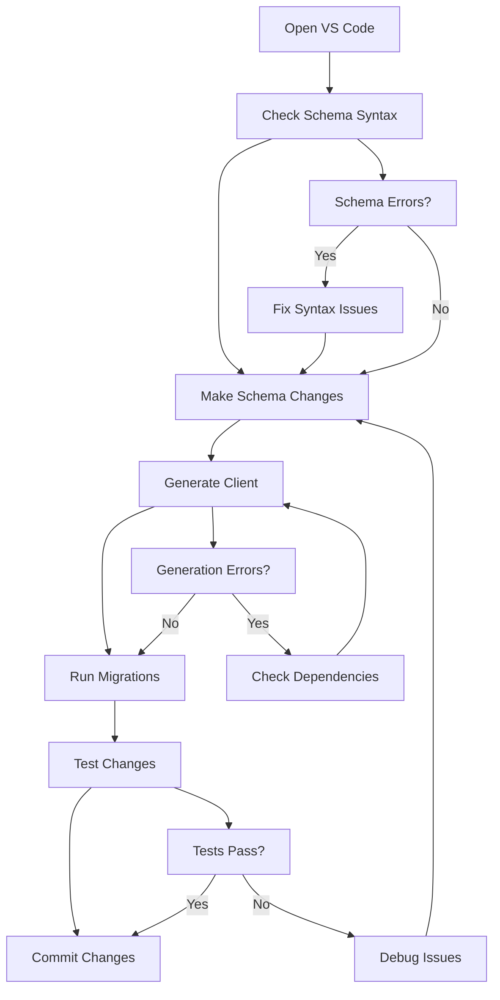

# 1.4.3 VS Code with Prisma Extension Configuration

## 📋 Section Overview
- **Duration**: 30 minutes
- **Prerequisites**: VS Code installed, basic understanding of code editors and extensions
- **Learning Objectives**: 
  - Configure VS Code for optimal Prisma development experience
  - Master Prisma extension features and capabilities
  - Set up intelligent code completion and syntax highlighting
  - Configure debugging and development workflows
  - Optimize editor settings for database-driven development
- **Difficulty Level**: Beginner to Intermediate

---

## 🎯 What You'll Learn

By the end of this section, you will:
- ✅ Install and configure the official Prisma VS Code extension
- ✅ Set up intelligent syntax highlighting and autocompletion
- ✅ Configure schema validation and error detection
- ✅ Master advanced Prisma development features in VS Code
- ✅ Optimize your development workflow with custom settings
- ✅ Troubleshoot common VS Code and Prisma integration issues

---

## 📖 Content

### Understanding VS Code for Prisma Development

Using VS Code for Prisma development is like having a **smart workshop with specialized tools**. Just as a master craftsman has perfectly organized tools that anticipate their needs, VS Code with proper Prisma configuration provides intelligent assistance, error prevention, and streamlined workflows that make database development feel intuitive and efficient.

### 🔧 The Smart Workshop Analogy

```
🔧 Master's Workshop = 💻 Configured VS Code

🛠️ Specialized Tools (Prisma Extension)
├── Schema blueprints → Prisma schema syntax highlighting
├── Measurement tools → Type checking and validation
├── Safety guards → Error detection and warnings
├── Auto-assembly → Code completion and snippets
├── Quality inspector → Schema linting and formatting
└── Reference manuals → Inline documentation and hints

📋 Organized Workbench (Editor Configuration)
├── Tool placement → Custom keybindings and shortcuts
├── Lighting setup → Theme and color configuration
├── Work surface → Editor layout and panels
├── Storage system → File explorer and project structure
├── Quick access → Command palette and search
└── Efficiency flows → Integrated terminal and tasks

🔍 Smart Assistance (IntelliSense Features)
├── Predictive suggestions → Context-aware completions
├── Error prevention → Real-time validation
├── Best practice guides → Linting and style enforcement
├── Quick fixes → Automated problem resolution
└── Learning adaptation → Progressive feature discovery
```

---

## 🔌 Installing the Prisma Extension

### 1. Official Prisma Extension Installation

The Prisma extension is the cornerstone of a productive Prisma development environment in VS Code.

#### **Method 1: VS Code Extensions Marketplace**

```bash
# Open VS Code and navigate to Extensions (Ctrl+Shift+X / Cmd+Shift+X)
# Search for "Prisma" by Prisma
# Click Install on the official extension
```

#### **Method 2: Command Line Installation**

```bash
# Install via VS Code CLI
code --install-extension Prisma.prisma

# Verify installation
code --list-extensions | grep Prisma
```

#### **Method 3: Extensions Configuration File**

```json
// .vscode/extensions.json - Recommended extensions for team
{
  "recommendations": [
    "Prisma.prisma",
    "ms-vscode.vscode-typescript-next",
    "bradlc.vscode-tailwindcss",
    "esbenp.prettier-vscode",
    "ms-vscode.vscode-json",
    "ms-vscode-remote.remote-containers"
  ]
}
```

### 2. Extension Features Overview

The Prisma extension provides comprehensive support for Prisma development:

#### **Core Features**

```prisma
// schema.prisma - Extension provides rich support
generator client {
  provider = "prisma-client-js"
  output   = "./generated/client"
  // 🎯 Auto-completion for generator options
}

datasource db {
  provider = "postgresql"
  url      = env("DATABASE_URL")
  // 🎯 Validation for provider values
}

model User {
  id        Int      @id @default(autoincrement())
  email     String   @unique
  name      String?
  posts     Post[]   // 🎯 Relationship validation
  profile   Profile?
  createdAt DateTime @default(now()) @map("created_at")
  
  @@map("users")
  // 🎯 Syntax highlighting for all Prisma features
}

model Post {
  id       Int     @id @default(autoincrement())
  title    String
  content  String?
  author   User    @relation(fields: [authorId], references: [id])
  authorId Int     @map("author_id")
  // 🎯 Error detection for relationship issues
  
  @@map("posts")
}

// 🎯 Real-time validation catches errors like:
model InvalidModel {
  id       String @id
  userId   Int
  user     User   @relation(fields: [nonExistentField], references: [id])
  //                        ^^^^^^^^^^^^^^^^ Error: Field doesn't exist
}
```

#### **Advanced Features**

```typescript
// TypeScript files get enhanced support too
import { PrismaClient } from '@prisma/client'

const prisma = new PrismaClient()

async function getUser(id: number) {
  // 🎯 Intelligent autocompletion for Prisma Client
  const user = await prisma.user.findUnique({
    where: { id },
    include: {
      posts: {
        where: { 
          published: true  // 🎯 Field suggestions based on schema
        },
        select: {
          id: true,
          title: true,
          content: true  // 🎯 Only valid fields suggested
        }
      },
      profile: true
    }
  })
  
  // 🎯 Type inference shows exact return type
  return user
}
```

---

## ⚙️ VS Code Configuration for Prisma

### 1. Workspace Settings

Create optimal settings for Prisma development in your workspace.

#### **Basic Workspace Configuration**

```json
// .vscode/settings.json
{
  // Prisma-specific settings
  "[prisma]": {
    "editor.defaultFormatter": "Prisma.prisma",
    "editor.formatOnSave": true,
    "editor.insertSpaces": true,
    "editor.tabSize": 2
  },
  
  // TypeScript settings for Prisma
  "typescript.preferences.quoteStyle": "single",
  "typescript.preferences.includePackageJsonAutoImports": "auto",
  "typescript.suggest.autoImports": true,
  "typescript.updateImportsOnFileMove.enabled": "always",
  
  // General editor improvements
  "editor.suggest.snippetsPreventQuickSuggestions": false,
  "editor.parameterHints.enabled": true,
  "editor.quickSuggestions": {
    "other": true,
    "comments": false,
    "strings": true
  },
  
  // File associations
  "files.associations": {
    "*.prisma": "prisma",
    ".env*": "dotenv"
  },
  
  // Auto-save for rapid development
  "files.autoSave": "onFocusChange",
  "files.autoSaveDelay": 1000,
  
  // Integrated terminal
  "terminal.integrated.defaultProfile.linux": "bash",
  "terminal.integrated.fontSize": 14,
  
  // Explorer settings
  "explorer.confirmDragAndDrop": false,
  "explorer.confirmDelete": false,
  "explorer.fileNesting.enabled": true,
  "explorer.fileNesting.patterns": {
    "*.prisma": "*.sql, *.env*, schema.prisma.lock",
    "package.json": "package-lock.json, yarn.lock, pnpm-lock.yaml",
    ".env": ".env.*"
  }
}
```

#### **Advanced Configuration**

```json
// .vscode/settings.json - Advanced features
{
  // Database-specific settings
  "sqltools.connections": [
    {
      "name": "PostgreSQL Local",
      "driver": "PostgreSQL",
      "previewLimit": 50,
      "server": "localhost",
      "port": 5432,
      "database": "myapp_development",
      "username": "postgres",
      "password": "password"
    }
  ],
  
  // Prisma Client generation
  "prisma.showPrismaDataPlatformNotification": false,
  "prisma.fileWatcher": true,
  
  // Enhanced IntelliSense
  "typescript.preferences.includeSourceLocations": true,
  "typescript.inlayHints.parameterNames.enabled": "all",
  "typescript.inlayHints.variableTypes.enabled": true,
  "typescript.inlayHints.functionLikeReturnTypes.enabled": true,
  
  // Code formatting
  "editor.formatOnPaste": true,
  "editor.formatOnType": true,
  "editor.codeActionsOnSave": {
    "source.fixAll": "explicit",
    "source.organizeImports": "explicit"
  },
  
  // Problem matching for Prisma CLI
  "problemMatchers": [
    {
      "name": "prisma",
      "owner": "prisma",
      "fileLocation": ["relative", "${workspaceFolder}"],
      "pattern": {
        "regexp": "^(.*):(\\d+):(\\d+):\\s+(warning|error):\\s+(.*)$",
        "file": 1,
        "line": 2,
        "column": 3,
        "severity": 4,
        "message": 5
      }
    }
  ]
}
```

### 2. Tasks Configuration

Set up VS Code tasks for common Prisma operations.

#### **Prisma Development Tasks**

```json
// .vscode/tasks.json
{
  "version": "2.0.0",
  "tasks": [
    {
      "label": "Prisma: Generate Client",
      "type": "shell",
      "command": "npx",
      "args": ["prisma", "generate"],
      "group": "build",
      "presentation": {
        "echo": true,
        "reveal": "always",
        "focus": false,
        "panel": "shared",
        "clear": true
      },
      "problemMatcher": "$prisma"
    },
    {
      "label": "Prisma: Push Schema",
      "type": "shell",
      "command": "npx",
      "args": ["prisma", "db", "push"],
      "group": "build",
      "presentation": {
        "echo": true,
        "reveal": "always",
        "focus": true,
        "panel": "shared"
      },
      "problemMatcher": "$prisma"
    },
    {
      "label": "Prisma: Migration Dev",
      "type": "shell",
      "command": "npx",
      "args": ["prisma", "migrate", "dev"],
      "group": "build",
      "presentation": {
        "echo": true,
        "reveal": "always",
        "focus": true,
        "panel": "shared"
      },
      "problemMatcher": "$prisma",
      "options": {
        "env": {
          "FORCE_COLOR": "1"
        }
      }
    },
    {
      "label": "Prisma: Studio",
      "type": "shell",
      "command": "npx",
      "args": ["prisma", "studio"],
      "group": "test",
      "isBackground": true,
      "presentation": {
        "echo": true,
        "reveal": "always",
        "focus": false,
        "panel": "dedicated"
      },
      "problemMatcher": {
        "pattern": {
          "regexp": "^.*$",
          "file": 1,
          "location": 2,
          "message": 3
        },
        "background": {
          "activeOnStart": true,
          "beginsPattern": "^Starting Prisma Studio",
          "endsPattern": "^Prisma Studio is up"
        }
      }
    },
    {
      "label": "Prisma: Reset Database",
      "type": "shell",
      "command": "npx",
      "args": ["prisma", "migrate", "reset", "--force"],
      "group": "test",
      "presentation": {
        "echo": true,
        "reveal": "always",
        "focus": true,
        "panel": "shared"
      },
      "problemMatcher": "$prisma"
    },
    {
      "label": "Prisma: Format Schema",
      "type": "shell",
      "command": "npx",
      "args": ["prisma", "format"],
      "group": "build",
      "presentation": {
        "echo": true,
        "reveal": "silent",
        "focus": false,
        "panel": "shared"
      }
    },
    {
      "label": "Prisma: Validate Schema",
      "type": "shell",
      "command": "npx",
      "args": ["prisma", "validate"],
      "group": "test",
      "presentation": {
        "echo": true,
        "reveal": "always",
        "focus": false,
        "panel": "shared"
      },
      "problemMatcher": "$prisma"
    }
  ]
}
```

#### **Compound Tasks for Workflows**

```json
// .vscode/tasks.json - Add to existing tasks array
{
  "label": "Prisma: Full Development Setup",
  "dependsOrder": "sequence",
  "dependsOn": [
    "Prisma: Generate Client",
    "Prisma: Migration Dev",
    "Prisma: Studio"
  ],
  "group": "build",
  "presentation": {
    "echo": true,
    "reveal": "always",
    "focus": true,
    "panel": "shared"
  }
},
{
  "label": "Prisma: Quick Schema Update",
  "dependsOrder": "sequence",
  "dependsOn": [
    "Prisma: Format Schema",
    "Prisma: Validate Schema",
    "Prisma: Push Schema"
  ],
  "group": "build"
}
```

### 3. Keybindings Configuration

Set up custom keybindings for faster Prisma development.

#### **Custom Prisma Keybindings**

```json
// .vscode/keybindings.json
[
  {
    "key": "ctrl+shift+p ctrl+g",
    "command": "workbench.action.tasks.runTask",
    "args": "Prisma: Generate Client",
    "when": "resourceExtname == .prisma || resourceExtname == .ts"
  },
  {
    "key": "ctrl+shift+p ctrl+m",
    "command": "workbench.action.tasks.runTask",
    "args": "Prisma: Migration Dev",
    "when": "resourceExtname == .prisma"
  },
  {
    "key": "ctrl+shift+p ctrl+s",
    "command": "workbench.action.tasks.runTask",
    "args": "Prisma: Studio",
    "when": "resourceExtname == .prisma || resourceExtname == .ts"
  },
  {
    "key": "ctrl+shift+p ctrl+f",
    "command": "workbench.action.tasks.runTask",
    "args": "Prisma: Format Schema",
    "when": "resourceExtname == .prisma"
  },
  {
    "key": "ctrl+shift+p ctrl+v",
    "command": "workbench.action.tasks.runTask",
    "args": "Prisma: Validate Schema",
    "when": "resourceExtname == .prisma"
  },
  {
    "key": "ctrl+shift+p ctrl+r",
    "command": "workbench.action.tasks.runTask",
    "args": "Prisma: Reset Database",
    "when": "resourceExtname == .prisma"
  }
]
```

---

## 🎨 Theme and UI Customization

### 1. Prisma-Optimized Color Themes

Enhance your Prisma development experience with optimized color schemes.

#### **Theme Recommendations**

```json
// .vscode/settings.json - Theme settings
{
  // Recommended themes for Prisma development
  "workbench.colorTheme": "One Dark Pro Darker", // or your preference
  
  // Custom token colors for Prisma
  "editor.tokenColorCustomizations": {
    "[One Dark Pro Darker]": {
      "textMateRules": [
        {
          "scope": "keyword.other.prisma",
          "settings": {
            "foreground": "#C678DD",
            "fontStyle": "bold"
          }
        },
        {
          "scope": "entity.name.type.prisma",
          "settings": {
            "foreground": "#E06C75",
            "fontStyle": "bold"
          }
        },
        {
          "scope": "support.type.prisma",
          "settings": {
            "foreground": "#56B6C2"
          }
        },
        {
          "scope": "variable.other.prisma",
          "settings": {
            "foreground": "#D19A66"
          }
        }
      ]
    }
  },
  
  // Semantic highlighting for better code understanding
  "editor.semanticHighlighting.enabled": true,
  "editor.semanticTokenColorCustomizations": {
    "[One Dark Pro Darker]": {
      "rules": {
        "class:prisma": "#E06C75",
        "property:prisma": "#D19A66",
        "type:prisma": "#56B6C2"
      }
    }
  }
}
```

### 2. Icon Theme Configuration

```json
// .vscode/settings.json - Icon settings
{
  "workbench.iconTheme": "material-icon-theme",
  "material-icon-theme.files.associations": {
    "*.prisma": "database",
    "schema.prisma": "database-settings",
    ".env.local": "tune",
    ".env.development": "tune",
    ".env.production": "tune"
  },
  "material-icon-theme.folders.associations": {
    "prisma": "database",
    "migrations": "database",
    "generated": "tools"
  }
}
```

---

## 🚀 Advanced VS Code Features for Prisma

### 1. Code Snippets

Create custom snippets for common Prisma patterns.

#### **Custom Prisma Snippets**

```json
// .vscode/prisma.code-snippets
{
  "Prisma Model": {
    "prefix": "pmodel",
    "body": [
      "model ${1:ModelName} {",
      "  id        ${2:Int}      @id @default(${3:autoincrement()})",
      "  ${4:field}    ${5:String}",
      "  createdAt DateTime  @default(now()) @map(\"created_at\")",
      "  updatedAt DateTime  @updatedAt @map(\"updated_at\")",
      "",
      "  @@map(\"${6:table_name}\")",
      "}"
    ],
    "description": "Create a new Prisma model with common fields"
  },
  "Prisma Relation": {
    "prefix": "prelation",
    "body": [
      "${1:relatedModel} ${2:RelatedModel} @relation(fields: [${3:fieldId}], references: [${4:id}])",
      "${3:fieldId}      ${5:Int}           @map(\"${6:field_id}\")"
    ],
    "description": "Create a Prisma relation"
  },
  "Prisma Enum": {
    "prefix": "penum",
    "body": [
      "enum ${1:EnumName} {",
      "  ${2:VALUE_ONE}",
      "  ${3:VALUE_TWO}",
      "  ${4:VALUE_THREE}",
      "}"
    ],
    "description": "Create a Prisma enum"
  },
  "Prisma Client Query": {
    "prefix": "pquery",
    "body": [
      "const ${1:result} = await prisma.${2:model}.${3:findUnique}({",
      "  where: { ${4:id}: ${5:value} },",
      "  ${6:include: {",
      "    ${7:relation}: true",
      "  \\}},",
      "})"
    ],
    "description": "Create a Prisma client query"
  },
  "Prisma Transaction": {
    "prefix": "ptransaction",
    "body": [
      "const ${1:result} = await prisma.$transaction([",
      "  prisma.${2:model}.${3:create}({",
      "    data: {",
      "      ${4:field}: ${5:value}",
      "    }",
      "  }),",
      "  prisma.${6:model}.${7:update}({",
      "    where: { ${8:id}: ${9:value} },",
      "    data: {",
      "      ${10:field}: ${11:value}",
      "    }",
      "  })",
      "])"
    ],
    "description": "Create a Prisma transaction"
  }
}
```

### 2. Debugging Configuration

Set up debugging for Prisma applications.

#### **Launch Configuration**

```json
// .vscode/launch.json
{
  "version": "0.2.0",
  "configurations": [
    {
      "type": "node",
      "request": "launch",
      "name": "Debug Prisma App",
      "skipFiles": ["<node_internals>/**"],
      "program": "${workspaceFolder}/src/index.ts",
      "preLaunchTask": "Prisma: Generate Client",
      "outFiles": ["${workspaceFolder}/dist/**/*.js"],
      "env": {
        "NODE_ENV": "development",
        "DEBUG": "prisma:*"
      },
      "envFile": "${workspaceFolder}/.env",
      "sourceMaps": true,
      "restart": true,
      "protocol": "inspector",
      "console": "integratedTerminal",
      "internalConsoleOptions": "neverOpen"
    },
    {
      "type": "node",
      "request": "launch",
      "name": "Debug Prisma Script",
      "skipFiles": ["<node_internals>/**"],
      "program": "${workspaceFolder}/scripts/${input:scriptName}",
      "env": {
        "NODE_ENV": "development"
      },
      "envFile": "${workspaceFolder}/.env",
      "console": "integratedTerminal"
    },
    {
      "type": "node",
      "request": "launch",
      "name": "Debug Tests",
      "skipFiles": ["<node_internals>/**"],
      "program": "${workspaceFolder}/node_modules/.bin/jest",
      "args": ["--runInBand", "--no-cache"],
      "env": {
        "NODE_ENV": "test"
      },
      "envFile": "${workspaceFolder}/.env.test",
      "console": "integratedTerminal",
      "internalConsoleOptions": "neverOpen"
    }
  ],
  "inputs": [
    {
      "id": "scriptName",
      "description": "Script to debug",
      "default": "seed.ts",
      "type": "promptString"
    }
  ]
}
```

### 3. Extensions Ecosystem

Recommended extensions that complement Prisma development.

#### **Essential Extensions for Prisma Development**

```json
// .vscode/extensions.json - Complete recommendations
{
  "recommendations": [
    // Core Prisma
    "Prisma.prisma",
    
    // TypeScript & JavaScript
    "ms-vscode.vscode-typescript-next",
    "usernamehw.errorlens",
    "bradlc.vscode-tailwindcss",
    
    // Code formatting and quality
    "esbenp.prettier-vscode",
    "dbaeumer.vscode-eslint",
    "ms-vscode.vscode-json",
    
    // Database tools
    "mtxr.sqltools",
    "mtxr.sqltools-driver-pg",
    "mtxr.sqltools-driver-mysql",
    "mtxr.sqltools-driver-sqlite",
    
    // Development tools
    "ms-vscode-remote.remote-containers",
    "ms-azuretools.vscode-docker",
    "ms-vscode.vscode-json",
    
    // Git and version control
    "eamodio.gitlens",
    "github.vscode-pull-request-github",
    
    // Productivity
    "ms-vscode.vscode-json",
    "redhat.vscode-yaml",
    "bierner.markdown-mermaid",
    
    // Testing
    "hbenl.vscode-test-explorer",
    "ms-vscode.test-adapter-converter"
  ]
}
```

---

## 🔧 Troubleshooting Common Issues

### 1. Extension Not Working

#### **Diagnostic Steps**

```bash
# Check VS Code version (requires 1.70+)
code --version

# Verify Prisma extension installation
code --list-extensions | grep Prisma

# Check extension logs
# Command Palette: "Developer: Show Logs" > Extension Host

# Restart extension host
# Command Palette: "Developer: Restart Extension Host"
```

#### **Common Fixes**

```json
// .vscode/settings.json - Troubleshooting settings
{
  // Force extension activation
  "prisma.trace.server": "verbose",
  "typescript.preferences.includePackageJsonAutoImports": "auto",
  
  // Clear extension cache
  "extensions.autoUpdate": false,
  
  // Workspace trust (required for some features)
  "security.workspace.trust.enabled": true
}
```

### 2. Schema Validation Issues

```prisma
// Common schema issues and solutions

// ❌ Problem: Extension doesn't recognize schema
generator client {
  provider = "prisma-client-js"
  // Solution: Ensure this is in schema.prisma file
}

// ❌ Problem: Relationship errors not showing
model User {
  id    Int    @id @default(autoincrement())
  posts Post[] // Ensure related model exists
}

model Post {
  id       Int  @id @default(autoincrement())
  authorId Int  @map("author_id")
  author   User @relation(fields: [authorId], references: [id])
  // Solution: Check field names match exactly
}
```

### 3. Performance Issues

```json
// .vscode/settings.json - Performance optimization
{
  // Limit file watching
  "files.watcherExclude": {
    "**/node_modules/**": true,
    "**/dist/**": true,
    "**/build/**": true,
    "**/.git/**": true
  },
  
  // Optimize TypeScript service
  "typescript.disableAutomaticTypeAcquisition": true,
  "typescript.preferences.includeSourceLocations": false,
  
  // Prisma-specific optimizations
  "prisma.fileWatcher": false, // If having issues
  "search.exclude": {
    "**/node_modules": true,
    "**/dist": true,
    "**/generated": true
  }
}
```

---

## 📊 VS Code Prisma Development Workflow

### Daily Development Tasks



### Keyboard Shortcuts Cheat Sheet

| Action | Windows/Linux | macOS | Description |
|--------|---------------|-------|-------------|
| **Generate Client** | `Ctrl+Shift+P` → `Ctrl+G` | `Cmd+Shift+P` → `Cmd+G` | Generate Prisma client |
| **Format Schema** | `Ctrl+Shift+P` → `Ctrl+F` | `Cmd+Shift+P` → `Cmd+F` | Format schema file |
| **Run Migration** | `Ctrl+Shift+P` → `Ctrl+M` | `Cmd+Shift+P` → `Cmd+M` | Run dev migration |
| **Open Studio** | `Ctrl+Shift+P` → `Ctrl+S` | `Cmd+Shift+P` → `Cmd+S` | Launch Prisma Studio |
| **Validate Schema** | `Ctrl+Shift+P` → `Ctrl+V` | `Cmd+Shift+P` → `Cmd+V` | Validate schema |

---

## 🧠 Knowledge Check

### VS Code Configuration Quiz

1. **What is the primary benefit of the Prisma VS Code extension?**
   - [ ] A) Faster database queries
   - [x] B) Intelligent syntax highlighting and autocompletion
   - [ ] C) Automatic database creation
   - [ ] D) Built-in testing framework

   **Explanation**: The extension provides intelligent code assistance, syntax highlighting, and validation for Prisma schemas.

2. **Which file is used to configure VS Code tasks for Prisma?**
   - [ ] A) `package.json`
   - [ ] B) `prisma.json`
   - [x] C) `.vscode/tasks.json`
   - [ ] D) `settings.json`

   **Explanation**: Tasks are configured in `.vscode/tasks.json` to automate common Prisma operations.

3. **What does the `@@map` directive do in a Prisma model?**
   - [x] A) Maps the model to a specific database table name
   - [ ] B) Creates a database index
   - [ ] C) Defines a relationship
   - [ ] D) Sets default values

   **Explanation**: `@@map` maps a Prisma model to a specific table name in the database.

### Practical Exercise: VS Code Setup

**Challenge**: Configure VS Code for optimal Prisma development

**Tasks**:
1. Create a complete `.vscode/settings.json` with Prisma optimizations
2. Set up custom tasks for common Prisma operations
3. Configure keybindings for faster development
4. Create custom snippets for your common patterns
5. Set up debugging configuration

```json
// Your .vscode/settings.json
{
  // Add your configuration here
}

// Your .vscode/tasks.json
{
  "version": "2.0.0",
  "tasks": [
    // Add your tasks here
  ]
}

// Your .vscode/keybindings.json
[
  // Add your keybindings here
]
```

---

## 💡 Key Takeaways

- 🔧 **Smart Tooling**: VS Code with Prisma extension provides intelligent development assistance
- ⚙️ **Configuration Matters**: Proper settings significantly improve development experience
- 🚀 **Automation**: Tasks and keybindings streamline common operations
- 🎨 **Customization**: Themes, snippets, and UI tweaks enhance productivity
- 🐛 **Debugging**: Proper debugging setup catches issues early
- 📊 **Workflow**: Organized development workflow prevents common mistakes
- 🔍 **Troubleshooting**: Understanding common issues saves development time
- 🎯 **Team Consistency**: Shared configurations ensure team-wide consistency

---

## 🔗 Navigation

**📍 Current Location**: Module 1 → Section 1.4 → Lesson 1.4.3

**⬅️ Previous**: [1.5.2 Database Installation (PostgreSQL recommended)](./1.5.2-database-installation-postgresql-recommended.md)
**➡️ Next**: [1.5.4 Git Workflow & Version Control Best Practices](./1.5.4-git-workflow-version-control-best-practices.md)

**🏠 Section Home**: [1.4 Development Environment](./README.md)
**📚 Module Home**: [Module 1: Foundations](../01-foundations.md)

**🗺️ Quick Links**:
- [Previous: Database Installation](./1.4.2-database-installation.md)
- [Next: Git Workflow](./1.4.4-git-workflow-version-control-best-practices.md)
- [Jump to: Module Assessment](../01-foundations.md#module-1-assessment)

---

*A well-configured development environment is the foundation of productive Prisma development. Ready to set up version control best practices? Continue to the next lesson!*
