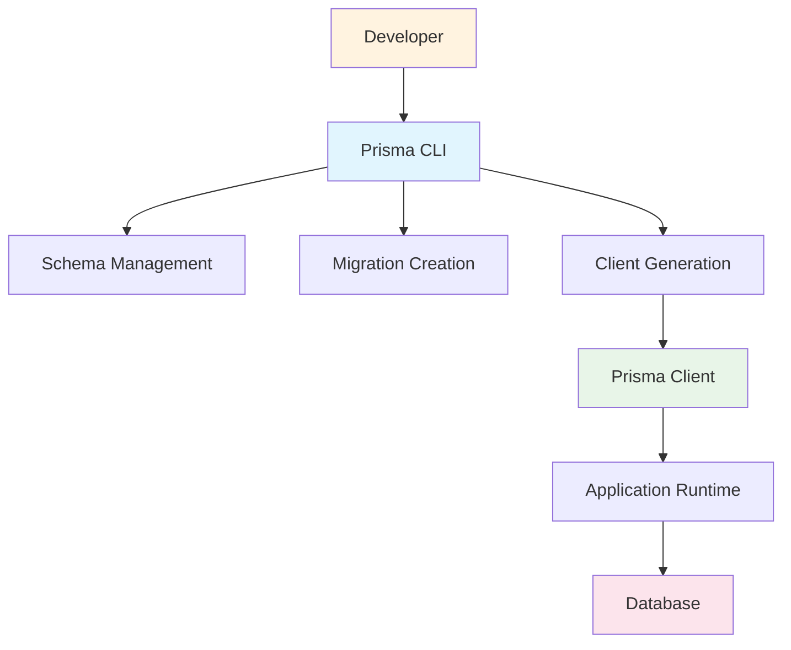

# 2.1.1 Installing Prisma CLI & Client

## 📋 Section Overview
- **Duration**: 25 minutes
- **Prerequisites**: 
  - Node.js 18+ installed and verified
  - npm or yarn package manager
  - Basic terminal/command line knowledge
  - Completed Module 1: Foundations
- **Learning Objectives**: 
  - Understand the difference between Prisma CLI and Prisma Client
  - Install Prisma CLI globally and locally
  - Install Prisma Client in a project
  - Verify successful installation and version compatibility
  - Understand Prisma's installation architecture and dependencies
- **Difficulty Level**: Beginner

---

## 🎯 What You'll Learn

By the end of this section, you will:
- ✅ Distinguish between Prisma CLI and Prisma Client packages
- ✅ Install Prisma CLI using multiple methods (global vs local)
- ✅ Add Prisma Client to your project dependencies
- ✅ Verify installation and check version compatibility
- ✅ Understand when to use each installation method
- ✅ Troubleshoot common installation issues

---

## 📖 Content

### Understanding Prisma's Installation Components

Installing Prisma is like **setting up a professional kitchen**. Just as a chef needs both specialized tools (knives, mixers) and ingredients (flour, spices) to create dishes, Prisma development requires both development tools (CLI) and runtime libraries (Client) to build database-driven applications.

### 🍳 The Professional Kitchen Analogy

```
🍳 Professional Kitchen = 💻 Prisma Development Environment

🔧 Kitchen Tools (Prisma CLI)
├── Chef's knife → prisma CLI commands
├── Mixing bowls → schema management
├── Measuring tools → migration creation
├── Timers → validation and formatting
├── Recipe cards → code generation
└── Inventory system → database introspection

🥘 Ingredients & Supplies (Prisma Client)
├── Fresh ingredients → runtime database client
├── Spice rack → query building methods
├── Cooking oils → connection management
├── Storage containers → type definitions
├── Preservation methods → caching layer
└── Quality standards → type safety

👨‍🍳 Kitchen Setup Process (Installation)
├── Tool acquisition → CLI installation
├── Ingredient sourcing → Client installation
├── Workspace preparation → project setup
├── Quality check → version verification
├── Test cooking → sample operations
└── Daily operations → development workflow
```

---

## 🔧 Prisma CLI vs Prisma Client

### Understanding the Components

Before installation, it's crucial to understand what each component does:

#### **Prisma CLI (`prisma`)**
The command-line interface for Prisma development operations.

**Purpose**: Development-time tool for:
- Initializing new Prisma projects
- Managing database schemas
- Creating and running migrations
- Generating Prisma Client code
- Database introspection and seeding
- Opening Prisma Studio

**Installation**: Can be installed globally or as a dev dependency

#### **Prisma Client (`@prisma/client`)**
The runtime library for database operations in your application.

**Purpose**: Runtime library for:
- Executing database queries
- Providing type-safe database access
- Managing database connections
- Handling transactions and batching
- Auto-completion and IntelliSense

**Installation**: Always installed as a project dependency

### Component Relationship



---

## 📦 Installation Methods

### 1. Installing Prisma CLI

#### **Method 1: Global Installation (Recommended for Beginners)**

```bash
# Install Prisma CLI globally using npm
npm install -g prisma

# Or using yarn
yarn global add prisma

# Or using pnpm
pnpm add -g prisma
```

**Advantages**:
- Available from any directory
- Single installation for all projects
- Convenient for quick operations

**Disadvantages**:
- Version conflicts between projects
- Harder to manage in team environments
- Not tracked in project dependencies

#### **Method 2: Local Installation (Recommended for Teams)**

```bash
# Install as development dependency
npm install prisma --save-dev

# Or using yarn
yarn add prisma --dev

# Or using pnpm
pnpm add prisma --save-dev
```

**Advantages**:
- Version consistency across team members
- Tracked in package.json
- No global version conflicts
- Better for CI/CD environments

**Disadvantages**:
- Must use npx/yarn/pnpm to run commands
- Separate installation for each project

#### **Running Locally Installed CLI**

```bash
# Using npx (npm 5.2+)
npx prisma --version

# Using yarn
yarn prisma --version

# Using pnpm
pnpm prisma --version

# Or add to package.json scripts
{
  "scripts": {
    "prisma": "prisma"
  }
}
# Then run: npm run prisma -- --version
```

### 2. Installing Prisma Client

Prisma Client is always installed as a project dependency:

```bash
# Install Prisma Client
npm install @prisma/client

# Or using yarn
yarn add @prisma/client

# Or using pnpm
pnpm add @prisma/client
```

**Note**: Prisma Client requires generation after installation, which we'll cover in lesson 2.2.4.

### 3. Complete Installation Example

Here's a complete setup for a new project:

```bash
# Create new project directory
mkdir my-prisma-app
cd my-prisma-app

# Initialize npm project
npm init -y

# Install TypeScript and development dependencies
npm install typescript ts-node @types/node --save-dev

# Install Prisma CLI locally
npm install prisma --save-dev

# Install Prisma Client
npm install @prisma/client

# Verify installations
npx prisma --version
node -e "console.log(require('@prisma/client/package.json').version)"
```

---

## 🔍 Installation Verification

### 1. Verify Prisma CLI Installation

```bash
# Check CLI version
prisma --version  # Global installation
# or
npx prisma --version  # Local installation

# Expected output example:
# prisma                  : 5.3.1
# @prisma/client          : 5.3.1
# Current platform        : darwin-arm64
# Query Engine (Node-API) : libquery-engine 61e140623197a131c2a6189271ffee05a7aa9a59 (at node_modules/@prisma/engines/libquery_engine-darwin-arm64.dylib.node)
# Migration Engine        : migration-engine-cli 61e140623197a131c2a6189271ffee05a7aa9a59 (at node_modules/@prisma/engines/migration-engine-darwin-arm64)
# Introspection Engine    : introspection-engine-cli 61e140623197a131c2a6189271ffee05a7aa9a59 (at node_modules/@prisma/engines/introspection-engine-darwin-arm64)
# Format Binary           : prisma-fmt 61e140623197a131c2a6189271ffee05a7aa9a59 (at node_modules/@prisma/engines/prisma-fmt-darwin-arm64)
# Format Wasm             : @prisma/prisma-fmt-wasm 5.3.1-1.61e140623197a131c2a6189271ffee05a7aa9a59
# Default Engines Hash    : 61e140623197a131c2a6189271ffee05a7aa9a59
# Studio                  : 0.494.0
```

### 2. Verify Prisma Client Installation

```bash
# Check if @prisma/client is in dependencies
npm list @prisma/client

# Or check package.json
cat package.json | grep -A 5 -B 5 "@prisma/client"

# Verify the package is accessible
node -e "console.log('Prisma Client version:', require('@prisma/client/package.json').version)"
```

### 3. Test Basic CLI Commands

```bash
# Check available commands
npx prisma --help

# Test format command (safe to run)
npx prisma format --help

# Test init command help (doesn't create files)
npx prisma init --help
```

---

## 🎛️ Installation Configuration

### 1. Package.json Integration

Add useful scripts to your `package.json`:

```json
{
  "name": "my-prisma-app",
  "version": "1.0.0",
  "scripts": {
    "dev": "ts-node src/index.ts",
    "build": "tsc",
    "start": "node dist/index.js",
    "prisma:generate": "prisma generate",
    "prisma:migrate": "prisma migrate dev",
    "prisma:studio": "prisma studio",
    "prisma:reset": "prisma migrate reset",
    "db:seed": "ts-node prisma/seed.ts"
  },
  "devDependencies": {
    "@types/node": "^20.0.0",
    "prisma": "^5.3.1",
    "ts-node": "^10.9.0",
    "typescript": "^5.0.0"
  },
  "dependencies": {
    "@prisma/client": "^5.3.1"
  }
}
```

### 2. TypeScript Configuration

Create a basic `tsconfig.json` for Prisma compatibility:

```json
{
  "compilerOptions": {
    "target": "ES2020",
    "module": "commonjs",
    "lib": ["ES2020"],
    "outDir": "./dist",
    "rootDir": "./src",
    "strict": true,
    "esModuleInterop": true,
    "skipLibCheck": true,
    "forceConsistentCasingInFileNames": true,
    "declaration": true,
    "declarationMap": true,
    "sourceMap": true
  },
  "include": [
    "src/**/*",
    "prisma/**/*"
  ],
  "exclude": [
    "node_modules",
    "dist"
  ]
}
```

### 3. Environment Setup Verification

Create a simple verification script:

```typescript
// scripts/verify-installation.ts
import { PrismaClient } from '@prisma/client'

async function verifyInstallation() {
  console.log('🔍 Verifying Prisma installation...')
  
  try {
    // Check if Prisma Client is importable
    console.log('✅ Prisma Client import successful')
    
    // Create client instance (won't connect yet)
    const prisma = new PrismaClient()
    console.log('✅ Prisma Client instantiation successful')
    
    console.log('🎉 Prisma installation verified!')
    console.log('📝 Next steps:')
    console.log('   1. Run `npx prisma init` to initialize your project')
    console.log('   2. Configure your database connection')
    console.log('   3. Define your schema')
    
  } catch (error) {
    console.error('❌ Installation verification failed:', error)
    console.log('💡 Troubleshooting:')
    console.log('   1. Ensure @prisma/client is installed')
    console.log('   2. Run `npm install` to update dependencies')
    console.log('   3. Check for version compatibility')
  }
}

verifyInstallation()
```

---

## 🔧 Troubleshooting Common Issues

### 1. Permission Issues (Global Installation)

```bash
# If you get permission errors on macOS/Linux
sudo npm install -g prisma

# Better solution: Configure npm to install globally without sudo
mkdir ~/.npm-global
npm config set prefix '~/.npm-global'
echo 'export PATH=~/.npm-global/bin:$PATH' >> ~/.profile
source ~/.profile

# Then install without sudo
npm install -g prisma
```

### 2. Version Mismatch Issues

```bash
# Check versions match
npx prisma --version

# If CLI and Client versions don't match:
npm update @prisma/client
npm update prisma
```

### 3. Node.js Version Compatibility

```bash
# Check Node.js version (Prisma requires 18+)
node --version

# If version is too old, update Node.js
# Use nvm (recommended):
curl -o- https://raw.githubusercontent.com/nvm-sh/nvm/v0.39.0/install.sh | bash
nvm install 18
nvm use 18
```

### 4. Engine Download Issues

```bash
# If Prisma engines fail to download
npx prisma generate --force-download

# Or set environment variable for manual engine management
export PRISMA_ENGINES_MIRROR=https://binaries.prisma.sh
```

### 5. Windows-Specific Issues

```cmd
# PowerShell execution policy issues
Set-ExecutionPolicy -ExecutionPolicy RemoteSigned -Scope CurrentUser

# Use PowerShell or Command Prompt instead of Git Bash for better compatibility
```

### 6. Corporate Network/Proxy Issues

```bash
# Configure npm for corporate proxy
npm config set proxy http://proxy.company.com:8080
npm config set https-proxy http://proxy.company.com:8080

# Or use .npmrc file
echo "proxy=http://proxy.company.com:8080" >> ~/.npmrc
echo "https-proxy=http://proxy.company.com:8080" >> ~/.npmrc
```

---

## 📊 Installation Decision Matrix

### When to Use Global vs Local Installation

| Scenario | Global | Local | Recommendation |
|----------|--------|--------|----------------|
| Personal learning | ✅ | ✅ | Global for convenience |
| Team project | ❌ | ✅ | Local for consistency |
| CI/CD pipeline | ❌ | ✅ | Local for reliability |
| Multiple projects | ❌ | ✅ | Local to avoid conflicts |
| Quick experiments | ✅ | ❌ | Global for speed |
| Production deployment | ❌ | ✅ | Local for stability |

### Installation Command Reference

```bash
# Quick reference for different scenarios

# Scenario 1: Learning/Personal Project (Global)
npm install -g prisma
npm install @prisma/client

# Scenario 2: Team Project (Local)
npm install prisma --save-dev
npm install @prisma/client

# Scenario 3: Complete New Project Setup
mkdir my-app && cd my-app
npm init -y
npm install typescript ts-node @types/node --save-dev
npm install prisma --save-dev
npm install @prisma/client

# Scenario 4: Adding to Existing Project
npm install prisma --save-dev
npm install @prisma/client
```

---

## 🧠 Knowledge Check

### Installation Quiz

1. **What is the difference between Prisma CLI and Prisma Client?**
   - [ ] A) They are the same package
   - [x] B) CLI is for development tools, Client is for runtime operations
   - [ ] C) CLI is for production, Client is for development
   - [ ] D) There is no difference

   **Explanation**: Prisma CLI provides development-time tools for schema management and migrations, while Prisma Client is the runtime library for database operations.

2. **Which installation method is recommended for team projects?**
   - [ ] A) Global installation only
   - [x] B) Local installation as dev dependency
   - [ ] C) Both global and local
   - [ ] D) Neither, use CDN

   **Explanation**: Local installation ensures version consistency across team members and integrates with package.json.

3. **What command verifies Prisma CLI installation?**
   - [ ] A) `prisma check`
   - [ ] B) `prisma status`
   - [x] C) `prisma --version`
   - [ ] D) `prisma info`

   **Explanation**: `prisma --version` shows detailed information about installed Prisma components and versions.

### Practical Exercise: Complete Installation

**Challenge**: Set up Prisma in a new TypeScript project

**Tasks**:
1. Create a new project directory
2. Initialize npm project
3. Install TypeScript and development dependencies
4. Install Prisma CLI locally
5. Install Prisma Client
6. Create package.json scripts for Prisma commands
7. Verify installation with version check

```bash
# Your commands here:
mkdir my-prisma-setup
cd my-prisma-setup
# Continue with installation steps...
```

**Validation Checklist**:
- [ ] `npx prisma --version` shows version information
- [ ] `npm list @prisma/client` confirms client installation
- [ ] package.json contains both prisma and @prisma/client
- [ ] TypeScript configuration is present
- [ ] Prisma scripts are available in package.json

---

## 💡 Key Takeaways

- 🔧 **Two Components**: Prisma CLI (development tools) and Prisma Client (runtime library) serve different purposes
- 📦 **Installation Choice**: Local installation preferred for teams, global for personal learning
- ✅ **Verification**: Always verify installation with version checks and test commands
- 🛠️ **Configuration**: Proper package.json and TypeScript setup enables smooth development
- 🚨 **Troubleshooting**: Common issues include permissions, versions, and network configurations
- 📋 **Scripts**: Package.json scripts streamline daily Prisma operations
- 🎯 **Version Compatibility**: Keep CLI and Client versions synchronized for best results

---

## 🔗 Navigation

**📍 Current Location**: Module 2 → Section 2.1 → Lesson 2.1.1

**⬅️ Previous**: [Module 1 Complete](../../01-foundations/01-foundations.md)
**➡️ Next**: [2.1.2 Project Initialization with `prisma init`](./2.1.2-project-initialization-prisma-init.md)

**🏠 Section Home**: [2.1 Installation & Setup](./README.md)
**📚 Module Home**: [Module 2: Getting Started](../02-getting-started.md)

**🗺️ Quick Links**:
- [Next: Project Initialization](./2.1.2-project-initialization-prisma-init.md)
- [Jump to: First Schema](../2.2-first-prisma-project/2.2.1-creating-your-first-schema.md)
- [Official Docs: Installation](https://www.prisma.io/docs/getting-started)

---

*Great work! You've successfully installed Prisma components. Ready to initialize your first Prisma project? Continue to the next lesson!*
