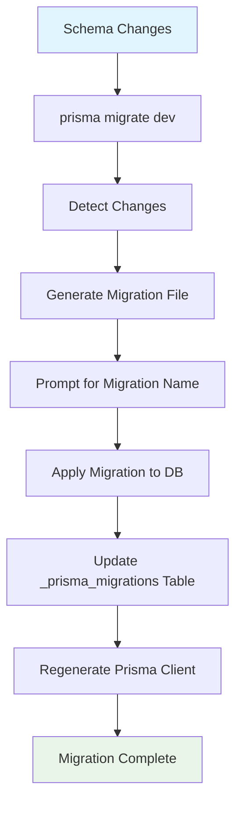

# 2.2.3 Running First Migration with `prisma migrate dev`

## 📋 Section Overview
- **Duration**: 40 minutes
- **Prerequisites**: 
  - Completed lessons 2.2.1 and 2.2.2
  - Database connection configured and tested
  - Prisma schema file ready with models
  - Understanding of database migrations concept
- **Learning Objectives**: 
  - Master the `prisma migrate dev` command and workflow
  - Understand migration files and their structure
  - Learn migration best practices and naming conventions
  - Handle migration conflicts and rollbacks
  - Implement safe migration strategies for team development
- **Difficulty Level**: Beginner to Intermediate

---

## 🎯 What You'll Learn

By the end of this section, you will:
- ✅ Execute your first successful database migration
- ✅ Understand migration file structure and SQL generation
- ✅ Master migration naming and organization strategies
- ✅ Handle migration conflicts and reset scenarios
- ✅ Implement team-friendly migration workflows
- ✅ Debug and troubleshoot migration issues
- ✅ Use migration commands effectively in different environments

---

## 📖 Content

### Understanding Prisma Migrations

Running your first Prisma migration is like **conducting the grand opening of a meticulously planned architectural project**. Just as construction managers coordinate the systematic transformation of empty land into functional buildings through carefully planned phases, database migrations transform an empty database into a structured data foundation through controlled, versioned changes that can be tracked, reviewed, and safely executed.

### 🏗️ The Grand Construction Project Analogy

```
🏗️ Construction Project = 📋 Database Migration Process

📐 Planning Phase (Schema Design)
├── Architectural blueprints → Prisma schema models
├── Engineering calculations → Relationship definitions
├── Material specifications → Field types and constraints
├── Safety regulations → Data validation rules
├── Timeline planning → Migration sequencing
└── Quality standards → Best practices

🚧 Construction Phases (Migration Execution)
├── Site preparation → Database setup
├── Foundation pouring → Initial table creation
├── Framework building → Adding relationships
├── System installation → Indexes and constraints
├── Safety inspection → Migration validation
└── Final walkthrough → Data verification

📝 Documentation Process (Migration Files)
├── Building permits → Migration approvals
├── Progress reports → Migration history
├── Change orders → Schema modifications
├── Inspection records → Migration logs
├── Completion certificates → Successful deployments
└── Maintenance manuals → Rollback procedures

🔧 Quality Control (Migration Safety)
├── Code compliance → Schema validation
├── Safety inspections → Pre-migration checks
├── Progress tracking → Migration status
├── Issue resolution → Conflict handling
├── Rollback procedures → Migration reversion
└── Final approval → Production deployment
```

---

## 🔧 Understanding `prisma migrate dev`

### What is `prisma migrate dev`?

The `prisma migrate dev` command is your primary tool for database schema evolution during development. It:

1. **Analyzes changes** between your current schema and the database
2. **Generates SQL migration files** to apply those changes
3. **Executes migrations** against your development database
4. **Updates the migration history** to track applied changes
5. **Regenerates Prisma Client** with the latest schema

### Migration Command Workflow



---

## 🚀 Your First Migration

### 1. Preparing for Migration

Before running your first migration, ensure you have:

```bash
# 1. Verify your schema is ready
npx prisma format
npx prisma validate

# 2. Test database connection
npm run test:connection  # From previous lesson

# 3. Check current database state
npx prisma db pull  # To see if database has existing structure
```

### 2. Running Your First Migration

With your schema from lesson 2.2.1, let's create your first migration:

```bash
# Navigate to your project directory
cd /path/to/your-prisma-project

# Run your first migration
npx prisma migrate dev --name init

# You'll see output like this:
# Environment variables loaded from .env
# Prisma schema loaded from prisma/schema.prisma
# Datasource "db": PostgreSQL database "myapp_dev", schema "public" at "localhost:5432"
# 
# ✔ Enter a name for the new migration: … init
# Applying migration `20240106120000_init`
# 
# The following migration(s) have been created and applied:
# 
# prisma/migrations/
# └── 20240106120000_init/
#     └── migration.sql
# 
# Your database is now in sync with your schema.
# 
# ✔ Generated Prisma Client (5.3.1 | library) to ./node_modules/@prisma/client in 89ms
```

### 3. Understanding the Generated Files

Your first migration creates several important files:

```
prisma/
├── schema.prisma
└── migrations/
    ├── migration_lock.toml
    └── 20240106120000_init/
        └── migration.sql
```

#### Migration Lock File

```toml
# prisma/migrations/migration_lock.toml
# Please do not edit this file manually
# It should be added to your version control system (Git)
provider = "postgresql"
```

#### Migration SQL File

```sql
-- prisma/migrations/20240106120000_init/migration.sql
-- CreateTable
CREATE TABLE "users" (
    "id" TEXT NOT NULL,
    "email" TEXT NOT NULL,
    "username" TEXT,
    "firstName" TEXT,
    "lastName" TEXT,
    "createdAt" TIMESTAMP(3) NOT NULL DEFAULT CURRENT_TIMESTAMP,
    "updatedAt" TIMESTAMP(3) NOT NULL,
    "isActive" BOOLEAN NOT NULL DEFAULT true,

    CONSTRAINT "users_pkey" PRIMARY KEY ("id")
);

-- CreateTable
CREATE TABLE "profiles" (
    "id" TEXT NOT NULL,
    "bio" TEXT,
    "avatar" TEXT,
    "userId" TEXT NOT NULL,
    "createdAt" TIMESTAMP(3) NOT NULL DEFAULT CURRENT_TIMESTAMP,
    "updatedAt" TIMESTAMP(3) NOT NULL,

    CONSTRAINT "profiles_pkey" PRIMARY KEY ("id")
);

-- CreateTable
CREATE TABLE "posts" (
    "id" TEXT NOT NULL,
    "title" TEXT NOT NULL,
    "content" TEXT,
    "excerpt" TEXT,
    "slug" TEXT NOT NULL,
    "published" BOOLEAN NOT NULL DEFAULT false,
    "publishedAt" TIMESTAMP(3),
    "authorId" TEXT NOT NULL,
    "categoryId" TEXT,
    "createdAt" TIMESTAMP(3) NOT NULL DEFAULT CURRENT_TIMESTAMP,
    "updatedAt" TIMESTAMP(3) NOT NULL,

    CONSTRAINT "posts_pkey" PRIMARY KEY ("id")
);

-- CreateTable
CREATE TABLE "comments" (
    "id" TEXT NOT NULL,
    "content" TEXT NOT NULL,
    "postId" TEXT NOT NULL,
    "authorId" TEXT NOT NULL,
    "parentId" TEXT,
    "createdAt" TIMESTAMP(3) NOT NULL DEFAULT CURRENT_TIMESTAMP,
    "updatedAt" TIMESTAMP(3) NOT NULL,

    CONSTRAINT "comments_pkey" PRIMARY KEY ("id")
);

-- CreateTable
CREATE TABLE "categories" (
    "id" TEXT NOT NULL,
    "name" TEXT NOT NULL,
    "description" TEXT,
    "slug" TEXT NOT NULL,
    "parentId" TEXT,
    "createdAt" TIMESTAMP(3) NOT NULL DEFAULT CURRENT_TIMESTAMP,
    "updatedAt" TIMESTAMP(3) NOT NULL,

    CONSTRAINT "categories_pkey" PRIMARY KEY ("id")
);

-- CreateTable
CREATE TABLE "tags" (
    "id" TEXT NOT NULL,
    "name" TEXT NOT NULL,
    "color" TEXT,
    "createdAt" TIMESTAMP(3) NOT NULL DEFAULT CURRENT_TIMESTAMP,

    CONSTRAINT "tags_pkey" PRIMARY KEY ("id")
);

-- CreateTable
CREATE TABLE "post_tags" (
    "postId" TEXT NOT NULL,
    "tagId" TEXT NOT NULL,
    "createdAt" TIMESTAMP(3) NOT NULL DEFAULT CURRENT_TIMESTAMP,

    CONSTRAINT "post_tags_pkey" PRIMARY KEY ("postId","tagId")
);

-- CreateIndex
CREATE UNIQUE INDEX "users_email_key" ON "users"("email");

-- CreateIndex
CREATE UNIQUE INDEX "users_username_key" ON "users"("username");

-- CreateIndex
CREATE INDEX "users_email_idx" ON "users"("email");

-- CreateIndex
CREATE INDEX "users_createdAt_idx" ON "users"("createdAt");

-- CreateIndex
CREATE UNIQUE INDEX "profiles_userId_key" ON "profiles"("userId");

-- CreateIndex
CREATE UNIQUE INDEX "posts_slug_key" ON "posts"("slug");

-- CreateIndex
CREATE INDEX "posts_slug_idx" ON "posts"("slug");

-- CreateIndex
CREATE INDEX "posts_published_idx" ON "posts"("published");

-- CreateIndex
CREATE INDEX "posts_authorId_idx" ON "posts"("authorId");

-- CreateIndex
CREATE INDEX "comments_postId_idx" ON "comments"("postId");

-- CreateIndex
CREATE INDEX "comments_authorId_idx" ON "comments"("authorId");

-- CreateIndex
CREATE UNIQUE INDEX "categories_name_key" ON "categories"("name");

-- CreateIndex
CREATE UNIQUE INDEX "categories_slug_key" ON "categories"("slug");

-- CreateIndex
CREATE INDEX "categories_slug_idx" ON "categories"("slug");

-- CreateIndex
CREATE UNIQUE INDEX "tags_name_key" ON "tags"("name");

-- AddForeignKey
ALTER TABLE "profiles" ADD CONSTRAINT "profiles_userId_fkey" FOREIGN KEY ("userId") REFERENCES "users"("id") ON DELETE CASCADE ON UPDATE CASCADE;

-- AddForeignKey
ALTER TABLE "posts" ADD CONSTRAINT "posts_authorId_fkey" FOREIGN KEY ("authorId") REFERENCES "users"("id") ON DELETE CASCADE ON UPDATE CASCADE;

-- AddForeignKey
ALTER TABLE "posts" ADD CONSTRAINT "posts_categoryId_fkey" FOREIGN KEY ("categoryId") REFERENCES "categories"("id") ON DELETE SET NULL ON UPDATE CASCADE;

-- AddForeignKey
ALTER TABLE "comments" ADD CONSTRAINT "comments_postId_fkey" FOREIGN KEY ("postId") REFERENCES "posts"("id") ON DELETE CASCADE ON UPDATE CASCADE;

-- AddForeignKey
ALTER TABLE "comments" ADD CONSTRAINT "comments_authorId_fkey" FOREIGN KEY ("authorId") REFERENCES "users"("id") ON DELETE CASCADE ON UPDATE CASCADE;

-- AddForeignKey
ALTER TABLE "comments" ADD CONSTRAINT "comments_parentId_fkey" FOREIGN KEY ("parentId") REFERENCES "comments"("id") ON DELETE SET NULL ON UPDATE CASCADE;

-- AddForeignKey
ALTER TABLE "categories" ADD CONSTRAINT "categories_parentId_fkey" FOREIGN KEY ("parentId") REFERENCES "categories"("id") ON DELETE SET NULL ON UPDATE CASCADE;

-- AddForeignKey
ALTER TABLE "post_tags" ADD CONSTRAINT "post_tags_postId_fkey" FOREIGN KEY ("postId") REFERENCES "posts"("id") ON DELETE CASCADE ON UPDATE CASCADE;

-- AddForeignKey
ALTER TABLE "post_tags" ADD CONSTRAINT "post_tags_tagId_fkey" FOREIGN KEY ("tagId") REFERENCES "tags"("id") ON DELETE CASCADE ON UPDATE CASCADE;
```

---

## 📝 Migration Best Practices

### 1. Migration Naming Conventions

Choose descriptive names that clearly indicate what the migration does:

```bash
# ✅ Good migration names
npx prisma migrate dev --name init
npx prisma migrate dev --name add_user_profile_relation
npx prisma migrate dev --name create_post_table
npx prisma migrate dev --name add_email_verification
npx prisma migrate dev --name optimize_user_indexes
npx prisma migrate dev --name add_soft_delete_to_posts

# ❌ Poor migration names
npx prisma migrate dev --name change
npx prisma migrate dev --name update
npx prisma migrate dev --name fix
npx prisma migrate dev --name temp
```

### 2. Migration File Organization

```
prisma/migrations/
├── migration_lock.toml
├── 20240106120000_init/
│   └── migration.sql
├── 20240107140000_add_user_profile_relation/
│   └── migration.sql
├── 20240108100000_create_post_table/
│   └── migration.sql
├── 20240109160000_add_email_verification/
│   └── migration.sql
└── 20240110130000_optimize_user_indexes/
    └── migration.sql
```

### 3. Incremental Schema Changes

Make small, focused changes rather than large, complex migrations:

```prisma
// ✅ Good: Small, focused change
model User {
  id        String   @id @default(cuid())
  email     String   @unique
  name      String?
  
  // Add one new field at a time
  emailVerified Boolean @default(false) // New field
  
  createdAt DateTime @default(now())
  updatedAt DateTime @updatedAt
  
  @@map("users")
}

// ❌ Avoid: Multiple complex changes at once
model User {
  id            String   @id @default(cuid())
  email         String   @unique
  name          String?
  emailVerified Boolean  @default(false)    // New field
  phoneNumber   String?                     // New field
  avatar        String?                     // New field
  preferences   Json     @default("{}")     // New field
  
  // Multiple relationship changes
  profile       Profile?
  posts         Post[]
  sessions      Session[] // New relationship
  
  createdAt DateTime @default(now())
  updatedAt DateTime @updatedAt
  
  // Multiple index changes
  @@index([email])
  @@index([phoneNumber]) // New index
  @@index([createdAt])
  @@index([emailVerified, createdAt]) // New composite index
  
  @@map("users")
}
```

---

## 🔄 Common Migration Scenarios

### 1. Adding a New Model

```prisma
// Add to your schema.prisma
model Newsletter {
  id          String   @id @default(cuid())
  email       String   @unique
  subscribedAt DateTime @default(now())
  isActive    Boolean  @default(true)
  
  @@map("newsletters")
}
```

```bash
# Create migration
npx prisma migrate dev --name add_newsletter_model
```

### 2. Adding Fields to Existing Model

```prisma
model User {
  id            String   @id @default(cuid())
  email         String   @unique
  name          String?
  
  // New fields
  phoneNumber   String?
  emailVerified Boolean  @default(false)
  
  createdAt DateTime @default(now())
  updatedAt DateTime @updatedAt
  
  @@map("users")
}
```

```bash
# Create migration for new fields
npx prisma migrate dev --name add_phone_and_email_verification
```

### 3. Adding Relationships

```prisma
model User {
  id       String @id @default(cuid())
  email    String @unique
  name     String?
  
  // New relationship
  sessions Session[]
  
  @@map("users")
}

model Session {
  id        String   @id @default(cuid())
  token     String   @unique
  expiresAt DateTime
  
  // Foreign key
  userId String
  user   User   @relation(fields: [userId], references: [id], onDelete: Cascade)
  
  createdAt DateTime @default(now())
  
  @@map("sessions")
}
```

```bash
# Create migration for relationship
npx prisma migrate dev --name add_user_sessions
```

### 4. Modifying Field Types

```prisma
model Post {
  id      String @id @default(cuid())
  title   String
  
  // Change from String? to String @db.Text
  content String @db.Text // More storage for long content
  
  @@map("posts")
}
```

```bash
# Create migration for field type change
npx prisma migrate dev --name change_post_content_to_text
```

---

## 🚨 Handling Migration Issues

### 1. Migration Conflicts

When multiple team members create migrations simultaneously:

```bash
# Error: Migration conflict detected
# Your migration file conflicts with existing migrations
# Resolution steps:

# 1. Pull latest changes from your team
git pull origin main

# 2. Reset your migration state
npx prisma migrate reset

# 3. Apply all migrations from the team
npx prisma migrate dev

# 4. If needed, create a new migration for your changes
npx prisma migrate dev --name your_feature_name
```

### 2. Failed Migrations

When a migration fails during execution:

```bash
# Error: Migration failed to apply
# Resolution options:

# Option 1: Fix the schema and try again
npx prisma migrate dev

# Option 2: Mark migration as applied (if manually fixed)
npx prisma migrate resolve --applied 20240106120000_failed_migration

# Option 3: Mark migration as rolled back
npx prisma migrate resolve --rolled-back 20240106120000_failed_migration

# Option 4: Reset and start over (development only)
npx prisma migrate reset
```

### 3. Schema Drift Detection

When your database doesn't match your schema:

```bash
# Prisma will detect schema drift and warn you
# Warning: Your database schema is not in sync with your migration history

# Check what's different
npx prisma db pull --print

# Options to resolve:
# 1. Reset migrations (development only)
npx prisma migrate reset

# 2. Create migration to match current DB state
npx prisma db pull
npx prisma migrate dev --name fix_schema_drift
```

---

## 🛠️ Advanced Migration Commands

### 1. Migration Status and History

```bash
# Check migration status
npx prisma migrate status

# Example output:
# Database schema is up to date!
# 
# The following migrations are applied:
# 
# 20240106120000_init
# 20240107140000_add_user_profile_relation
# 20240108100000_create_post_table

# View migration history in database
npx prisma studio
# Navigate to _prisma_migrations table
```

### 2. Development Migration Commands

```bash
# Create migration without applying (dry run)
npx prisma migrate dev --create-only --name test_migration

# Apply pending migrations
npx prisma migrate dev

# Reset database and apply all migrations
npx prisma migrate reset

# Generate client after migration
npx prisma generate
```

### 3. Production Migration Commands

```bash
# Deploy migrations to production (no prompts)
npx prisma migrate deploy

# Check migration status in production
npx prisma migrate status
```

---

## 📊 Migration Monitoring and Logging

### 1. Migration Logging Script

```typescript
// scripts/migration-logger.ts
import { execSync } from 'child_process'
import fs from 'fs'
import path from 'path'

interface MigrationInfo {
  id: string
  checksum: string
  finished_at: Date | null
  migration_name: string
  logs: string | null
  rolled_back_at: Date | null
  started_at: Date
  applied_steps_count: number
}

async function logMigrationStatus() {
  try {
    console.log('📊 Migration Status Report')
    console.log('═'.repeat(50))
    
    // Check current migration status
    const statusOutput = execSync('npx prisma migrate status', { 
      encoding: 'utf8',
      stdio: 'pipe'
    })
    
    console.log('📋 Current Status:')
    console.log(statusOutput)
    
    // List migration files
    const migrationsDir = path.join(process.cwd(), 'prisma', 'migrations')
    
    if (fs.existsSync(migrationsDir)) {
      const migrationDirs = fs.readdirSync(migrationsDir)
        .filter(dir => dir !== 'migration_lock.toml')
        .sort()
      
      console.log('\n📁 Migration Files:')
      migrationDirs.forEach((dir, index) => {
        const timestamp = dir.split('_')[0]
        const name = dir.split('_').slice(1).join('_')
        const date = new Date(
          parseInt(timestamp.substring(0, 4)),  // year
          parseInt(timestamp.substring(4, 6)) - 1,  // month (0-indexed)
          parseInt(timestamp.substring(6, 8)),  // day
          parseInt(timestamp.substring(8, 10)), // hour
          parseInt(timestamp.substring(10, 12)), // minute
          parseInt(timestamp.substring(12, 14))  // second
        )
        
        console.log(`  ${index + 1}. ${name}`)
        console.log(`     📅 Created: ${date.toISOString()}`)
        console.log(`     📁 Directory: ${dir}`)
        console.log('')
      })
    }
    
    console.log('═'.repeat(50))
    
  } catch (error) {
    console.error('❌ Error checking migration status:', error)
  }
}

// Run the logger
logMigrationStatus()
```

### 2. Pre-Migration Validation

```typescript
// scripts/pre-migration-check.ts
import { execSync } from 'child_process'
import { PrismaClient } from '@prisma/client'

async function preMigrationCheck() {
  console.log('🔍 Pre-Migration Validation')
  console.log('═'.repeat(40))
  
  const checks = [
    {
      name: 'Schema Validation',
      check: () => {
        execSync('npx prisma validate', { stdio: 'pipe' })
        return true
      }
    },
    {
      name: 'Database Connection',
      check: async () => {
        const prisma = new PrismaClient()
        await prisma.$connect()
        await prisma.$disconnect()
        return true
      }
    },
    {
      name: 'Migration Status',
      check: () => {
        const output = execSync('npx prisma migrate status', { 
          encoding: 'utf8',
          stdio: 'pipe'
        })
        return !output.includes('pending')
      }
    },
    {
      name: 'Schema Format',
      check: () => {
        try {
          execSync('npx prisma format --check', { stdio: 'pipe' })
          return true
        } catch {
          console.log('⚠️  Schema needs formatting - run: npx prisma format')
          return false
        }
      }
    }
  ]
  
  let allPassed = true
  
  for (const check of checks) {
    try {
      const passed = await check.check()
      console.log(`${passed ? '✅' : '❌'} ${check.name}`)
      if (!passed) allPassed = false
    } catch (error) {
      console.log(`❌ ${check.name}: ${error}`)
      allPassed = false
    }
  }
  
  console.log('═'.repeat(40))
  
  if (allPassed) {
    console.log('🎉 All checks passed! Ready for migration.')
  } else {
    console.log('⚠️  Some checks failed. Please fix issues before migrating.')
    process.exit(1)
  }
}

preMigrationCheck()
```

---

## 🧠 Knowledge Check

### Migration Quiz

1. **What does `prisma migrate dev` do?**
   - [ ] A) Only generates migration files
   - [ ] B) Only applies migrations to the database
   - [x] C) Generates migration files, applies them, and regenerates client
   - [ ] D) Only regenerates the Prisma client

   **Explanation**: `prisma migrate dev` is a comprehensive command that detects schema changes, generates migration files, applies them to the database, and regenerates the Prisma client.

2. **What should you do if you encounter a migration conflict?**
   - [ ] A) Delete the conflicting migration file
   - [ ] B) Force apply your migration
   - [x] C) Pull latest changes, reset migrations, and reapply
   - [ ] D) Ignore the conflict

   **Explanation**: Migration conflicts require pulling the latest changes from your team, resetting your migration state, and then creating a new migration for your changes.

3. **Which migration name is most descriptive?**
   - [ ] A) `fix`
   - [ ] B) `update_db`
   - [x] C) `add_email_verification_to_users`
   - [ ] D) `migration_1`

   **Explanation**: Descriptive migration names clearly indicate what changes are being made, making it easier to understand the migration history.

### Practical Exercise: Complete Migration Workflow

**Challenge**: Implement a complete migration workflow with multiple schema changes

**Tasks**:
1. Create initial migration with your schema
2. Add a new model with relationships
3. Modify existing fields and add indexes
4. Handle a simulated migration conflict
5. Implement migration validation scripts

**Validation Checklist**:
- [ ] Initial migration creates all tables correctly
- [ ] New model migration adds proper relationships
- [ ] Field modifications are applied safely
- [ ] Migration status shows all migrations applied
- [ ] Validation scripts run without errors

```bash
# Your migration commands:
npx prisma migrate dev --name init
# ... continue with your migration workflow
```

---

## 💡 Key Takeaways

- 🚀 **Migration Workflow**: `prisma migrate dev` handles the complete development migration process
- 📝 **Naming Matters**: Use descriptive migration names that clearly indicate the changes
- 🔄 **Incremental Changes**: Make small, focused migrations rather than large complex ones
- 🛡️ **Safety First**: Always validate schemas and test connections before migrating
- 👥 **Team Coordination**: Handle migration conflicts by coordinating with your team
- 📊 **Monitoring**: Track migration status and maintain clear migration history
- 🐞 **Troubleshooting**: Know how to resolve common migration issues and conflicts

---

## 🔗 Navigation

**📍 Current Location**: Module 2 → Section 2.2 → Lesson 2.2.3

**⬅️ Previous**: [2.2.2 Database Connection String Configuration](./2.2.2-database-connection-string-configuration.md)
**➡️ Next**: [2.2.4 Generating Prisma Client with `prisma generate`](./2.2.4-generating-prisma-client-prisma-generate.md)

**🏠 Section Home**: [2.2 First Prisma Project](./README.md)
**📚 Module Home**: [Module 2: Getting Started](../02-getting-started.md)

**🗺️ Quick Links**:
- [Next: Prisma Client Generation](./2.2.4-generating-prisma-client-prisma-generate.md)
- [Jump to: First CRUD Operations](./2.2.5-first-query-crud-operations.md)
- [Official Docs: Migrations](https://www.prisma.io/docs/concepts/components/prisma-migrate)

---

*Amazing! Your database schema is now live and ready. Time to generate your Prisma Client and start querying your data. Continue to the next lesson!*
