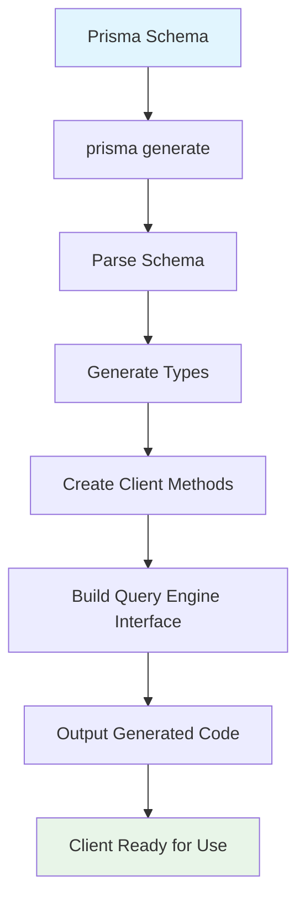

# 2.2.4 Generating Prisma Client with `prisma generate`

## 📋 Section Overview
- **Duration**: 35 minutes
- **Prerequisites**: 
  - Completed lessons 2.2.1 - 2.2.3
  - Successfully run your first migration
  - Database schema applied to your database
  - TypeScript configuration ready
- **Learning Objectives**: 
  - Master the Prisma Client generation process
  - Understand generated types and their usage
  - Configure client generation options and output
  - Implement custom client configurations
  - Handle client regeneration in development workflow
- **Difficulty Level**: Beginner to Intermediate

---

## 🎯 What You'll Learn

By the end of this section, you will:
- ✅ Generate and configure Prisma Client for your schema
- ✅ Understand the generated client structure and types
- ✅ Configure client generation options and output locations
- ✅ Implement client instantiation patterns and best practices
- ✅ Handle client regeneration in team development workflows
- ✅ Debug and troubleshoot client generation issues
- ✅ Optimize client configuration for different environments

---

## 📖 Content

### Understanding Prisma Client Generation

Generating Prisma Client is like **commissioning a master craftsman to create custom precision tools**. Just as a skilled artisan studies your blueprints and specifications to forge perfectly fitted instruments that match your exact requirements, Prisma Client generation analyzes your schema and creates a type-safe, custom-tailored database client with methods, types, and interfaces that perfectly match your data models.

### 🛠️ The Master Craftsman Workshop Analogy

```
🛠️ Master Craftsman Workshop = ⚡ Prisma Client Generation

📐 Blueprint Analysis (Schema Reading)
├── Design specifications → Model definitions
├── Material requirements → Field types and constraints
├── Assembly instructions → Relationship mappings
├── Quality standards → Validation rules
├── Tool requirements → Query operations needed
└── Custom features → Advanced configurations

🔨 Crafting Process (Code Generation)
├── Material selection → Type generation
├── Precision cutting → Method creation
├── Assembly work → Client structure building
├── Quality testing → Type validation
├── Tool calibration → Performance optimization
└── Final polishing → Code formatting

🎯 Custom Tool Creation (Generated Client)
├── Specialized instruments → Model-specific methods
├── Precision measurers → Type-safe operations
├── Assembly guides → Auto-completion support
├── Safety mechanisms → Runtime validation
├── Maintenance manual → Documentation generation
└── Quality guarantee → Type safety assurance

📦 Tool Delivery (Client Distribution)
├── Packaging standards → Output organization
├── Installation guide → Import instructions
├── Usage manual → API documentation
├── Maintenance schedule → Regeneration workflow
├── Update notifications → Schema change alerts
└── Support service → Error handling
```

---

## 🔧 Understanding `prisma generate`

### What is Prisma Client Generation?

The `prisma generate` command creates a fully type-safe database client from your Prisma schema. It:

1. **Reads your schema** and analyzes all models, fields, and relationships
2. **Generates TypeScript types** for every model and operation
3. **Creates client methods** for CRUD operations and advanced queries
4. **Builds type-safe interfaces** for all possible query results
5. **Optimizes the client** for your specific database and schema

### Generation Workflow



---

## 🚀 Generating Your First Client

### 1. Basic Client Generation

After your successful migration, generate your client:

```bash
# Generate Prisma Client
npx prisma generate

# You'll see output like this:
# Environment variables loaded from .env
# Prisma schema loaded from prisma/schema.prisma
# 
# ✔ Generated Prisma Client (5.3.1 | library) to ./node_modules/@prisma/client in 127ms
# 
# Start using Prisma Client in Node.js (See: https://pris.ly/d/client)
# ```
# import { PrismaClient } from '@prisma/client'
# const prisma = new PrismaClient()
# ```
# or start using Prisma Client at the edge (See: https://pris.ly/d/accelerate)
# ```
# import { PrismaClient } from '@prisma/client/edge'
# const prisma = new PrismaClient()
# ```
```

### 2. Understanding Generated Files

The generation process creates several important files and directories:

```
node_modules/@prisma/client/
├── index.d.ts          # Type definitions
├── index.js            # JavaScript client
├── package.json        # Package metadata
├── runtime/            # Runtime dependencies
├── edge.d.ts          # Edge runtime types
├── edge.js            # Edge runtime client
└── schema.prisma      # Copy of your schema
```

### 3. Exploring Generated Types

Let's examine what gets generated from your schema:

```typescript
// Generated types in node_modules/@prisma/client/index.d.ts

// Base model types
export type User = {
  id: string
  email: string
  username: string | null
  firstName: string | null
  lastName: string | null
  createdAt: Date
  updatedAt: Date
  isActive: boolean
}

export type Post = {
  id: string
  title: string
  content: string | null
  excerpt: string | null
  slug: string
  published: boolean
  publishedAt: Date | null
  authorId: string
  categoryId: string | null
  createdAt: Date
  updatedAt: Date
}

// Input types for operations
export type UserCreateInput = {
  id?: string
  email: string
  username?: string | null
  firstName?: string | null
  lastName?: string | null
  createdAt?: Date | string
  updatedAt?: Date | string
  isActive?: boolean
  profile?: ProfileCreateNestedOneWithoutUserInput
  posts?: PostCreateNestedManyWithoutAuthorInput
  comments?: CommentCreateNestedManyWithoutAuthorInput
}

export type UserUpdateInput = {
  id?: StringFieldUpdateOperationsInput | string
  email?: StringFieldUpdateOperationsInput | string
  username?: NullableStringFieldUpdateOperationsInput | string | null
  // ... more fields
}

// Relation types
export type UserGetPayload<S extends boolean | null | undefined | UserDefaultArgs> = 
  S extends { select: any, include: any } ? 'Please either choose `select` or `include`' :
  S extends true ? User :
  S extends undefined ? never :
  S extends { include: any } & (UserArgs | UserFindManyArgs)
  ? User  & {
    [P in TruthyKeys<S['include']>]:
        P extends 'profile' ? ProfileGetPayload<S['include'][P]> | null :
        P extends 'posts' ? Array < PostGetPayload<S['include'][P]>>  :
        P extends 'comments' ? Array < CommentGetPayload<S['include'][P]>>  : never
  } 
  : S extends { select: any } & (UserArgs | UserFindManyArgs)
  ? {
    [P in TruthyKeys<S['select']>]:
        P extends 'id' ? User['id'] :
        P extends 'email' ? User['email'] :
        P extends 'profile' ? ProfileGetPayload<S['select'][P]> | null :
        P extends 'posts' ? Array < PostGetPayload<S['select'][P]>>  : never
  }
  : User

// Client interface
export interface PrismaClient<
  T extends Prisma.PrismaClientOptions = Prisma.PrismaClientOptions,
  U = 'log' extends keyof T ? T['log'] extends Array<Prisma.LogLevel | Prisma.LogDefinition> ? Prisma.GetEvents<T['log']> : never : never,
  ExtArgs extends $Extensions.InternalArgs = $Extensions.DefaultArgs
> {
  /**
   * User operations
   */
  user: Prisma.UserDelegate<ExtArgs>;

  /**
   * Post operations  
   */
  post: Prisma.PostDelegate<ExtArgs>;

  /**
   * Comment operations
   */
  comment: Prisma.CommentDelegate<ExtArgs>;

  // ... more model delegates

  /**
   * Execute raw SQL queries
   */
  $queryRaw<T = unknown>(query: TemplateStringsArray | Prisma.Sql, ...values: any[]): Prisma.PrismaPromise<T>;

  /**
   * Execute raw SQL and return the number of affected rows
   */
  $executeRaw<T = unknown>(query: TemplateStringsArray | Prisma.Sql, ...values: any[]): Prisma.PrismaPromise<number>;
}
```

---

## ⚙️ Client Configuration Options

### 1. Generator Configuration in Schema

```prisma
// prisma/schema.prisma
generator client {
  provider = "prisma-client-js"
  
  // Custom output location
  output = "./generated/client"
  
  // Binary targets for deployment
  binaryTargets = ["native", "rhel-openssl-1.0.x", "debian-openssl-1.1.x"]
  
  // Preview features
  previewFeatures = ["jsonProtocol", "metrics"]
  
  // Engine type
  engineType = "library"
}
```

### 2. Advanced Generator Options

```prisma
generator client {
  provider = "prisma-client-js"
  
  // Output to custom location
  output = "../src/generated/prisma-client"
  
  // Multiple binary targets for cross-platform deployment
  binaryTargets = [
    "native",
    "linux-openssl-1.1.x", 
    "linux-openssl-3.0.x",
    "darwin-arm64",
    "windows"
  ]
  
  // Enable preview features
  previewFeatures = [
    "jsonProtocol",
    "metrics", 
    "tracing",
    "views"
  ]
  
  // Performance optimizations
  engineType = "library"
  
  // For serverless environments
  // engineType = "binary"
}
```

### 3. Multiple Generators

```prisma
// Multiple client generators for different purposes
generator client {
  provider = "prisma-client-js"
  output   = "./generated/client"
}

generator client_edge {
  provider = "prisma-client-js"
  output   = "./generated/edge-client"
  engineType = "library"
  previewFeatures = ["driverAdapters"]
}

generator docs {
  provider = "prisma-docs-generator"
  output   = "./generated/docs"
}
```

---

## 📦 Client Instantiation Patterns

### 1. Basic Client Setup

```typescript
// src/lib/prisma.ts
import { PrismaClient } from '@prisma/client'

// Basic client instantiation
const prisma = new PrismaClient()

export default prisma
```

### 2. Development vs Production Client

```typescript
// src/lib/prisma.ts
import { PrismaClient } from '@prisma/client'

// Environment-aware client configuration
const prisma = new PrismaClient({
  log: process.env.NODE_ENV === 'development' 
    ? ['query', 'info', 'warn', 'error']
    : ['warn', 'error'],
    
  errorFormat: 'pretty',
})

// Handle graceful shutdown
process.on('beforeExit', async () => {
  await prisma.$disconnect()
})

export default prisma
```

### 3. Singleton Pattern with Global Instance

```typescript
// src/lib/prisma.ts
import { PrismaClient } from '@prisma/client'

declare global {
  // Prevent multiple instances during development
  var __globalPrisma: PrismaClient | undefined
}

class PrismaManager {
  private static instance: PrismaClient

  static getInstance(): PrismaClient {
    if (this.instance) {
      return this.instance
    }

    // In development, use global instance to prevent multiple clients
    if (process.env.NODE_ENV === 'development') {
      if (!global.__globalPrisma) {
        global.__globalPrisma = new PrismaClient({
          log: ['query', 'info', 'warn', 'error'],
        })
      }
      this.instance = global.__globalPrisma
    } else {
      // In production, create new instance
      this.instance = new PrismaClient({
        log: ['warn', 'error'],
      })
    }

    return this.instance
  }

  static async disconnect(): Promise<void> {
    if (this.instance) {
      await this.instance.$disconnect()
    }
  }
}

export default PrismaManager.getInstance()
export { PrismaManager }
```

### 4. Advanced Client Configuration

```typescript
// src/lib/prisma.ts
import { PrismaClient, Prisma } from '@prisma/client'

interface PrismaConfig {
  environment: 'development' | 'staging' | 'production'
  enableLogging: boolean
  connectionTimeout: number
  queryTimeout: number
}

class ConfigurablePrismaClient {
  private client: PrismaClient
  private config: PrismaConfig

  constructor(config: PrismaConfig) {
    this.config = config
    this.client = this.createClient()
  }

  private createClient(): PrismaClient {
    const logLevels: Prisma.LogLevel[] = this.config.enableLogging
      ? ['query', 'info', 'warn', 'error']
      : ['warn', 'error']

    return new PrismaClient({
      log: logLevels.map(level => ({
        level,
        emit: 'event'
      })),
      
      datasources: {
        db: {
          url: process.env.DATABASE_URL,
        },
      },
    })
  }

  getClient(): PrismaClient {
    return this.client
  }

  async connect(): Promise<void> {
    try {
      await this.client.$connect()
      console.log(`✅ Database connected (${this.config.environment})`)
    } catch (error) {
      console.error('❌ Database connection failed:', error)
      throw error
    }
  }

  async disconnect(): Promise<void> {
    await this.client.$disconnect()
    console.log('🔌 Database disconnected')
  }

  async healthCheck(): Promise<boolean> {
    try {
      await this.client.$queryRaw`SELECT 1`
      return true
    } catch (error) {
      console.error('❌ Health check failed:', error)
      return false
    }
  }
}

// Create configured instance
const config: PrismaConfig = {
  environment: (process.env.NODE_ENV as any) || 'development',
  enableLogging: process.env.NODE_ENV === 'development',
  connectionTimeout: 30000,
  queryTimeout: 10000,
}

const prismaClient = new ConfigurablePrismaClient(config)

export default prismaClient.getClient()
export { prismaClient, ConfigurablePrismaClient }
```

---

## 🔄 Client Regeneration Workflow

### 1. Automatic Regeneration Triggers

```bash
# Client is automatically regenerated when:
npx prisma migrate dev    # After running migrations
npx prisma db push        # After pushing schema changes
npx prisma generate       # Manual regeneration

# Watch for schema changes and auto-regenerate
npx prisma generate --watch
```

### 2. Development Workflow Scripts

```json
// package.json
{
  "scripts": {
    "db:generate": "prisma generate",
    "db:generate:watch": "prisma generate --watch",
    
    "dev": "concurrently \"npm run db:generate:watch\" \"tsx watch src/index.ts\"",
    
    "db:reset": "prisma migrate reset && prisma generate",
    "db:deploy": "prisma migrate deploy && prisma generate",
    
    "build": "prisma generate && tsc",
    "start": "prisma generate && node dist/index.js",
    
    "postinstall": "prisma generate"
  }
}
```

### 3. Team Development Workflow

```bash
# .github/workflows/ci.yml
name: CI
on: [push, pull_request]

jobs:
  test:
    steps:
      - uses: actions/checkout@v3
      - uses: actions/setup-node@v3
      
      - name: Install dependencies
        run: npm install
        
      - name: Generate Prisma Client
        run: npx prisma generate
        
      - name: Run tests
        run: npm test
```

---

## 🎯 Type-Safe Client Usage Examples

### 1. Basic Model Operations

```typescript
// src/examples/basic-usage.ts
import prisma from '../lib/prisma'

async function basicOperations() {
  // Create with auto-completion and type safety
  const user = await prisma.user.create({
    data: {
      email: 'john@example.com',
      firstName: 'John',
      lastName: 'Doe',
      // TypeScript will warn about invalid fields
      // invalidField: 'test' // ❌ TypeScript error
    }
  })

  // Find with type-safe results
  const users = await prisma.user.findMany({
    where: {
      isActive: true,
    },
    select: {
      id: true,
      email: true,
      firstName: true,
      // Only selected fields are available in result type
    }
  })

  // Update with validation
  const updatedUser = await prisma.user.update({
    where: { id: user.id },
    data: {
      firstName: 'Johnny',
    }
  })

  console.log('✅ Basic operations completed')
  return { user, users, updatedUser }
}
```

### 2. Relationship Operations

```typescript
// src/examples/relationship-usage.ts
import prisma from '../lib/prisma'

async function relationshipOperations() {
  // Create with nested relations
  const userWithProfile = await prisma.user.create({
    data: {
      email: 'jane@example.com',
      firstName: 'Jane',
      profile: {
        create: {
          bio: 'Software developer passionate about databases',
          avatar: 'https://example.com/avatar.jpg'
        }
      }
    },
    include: {
      profile: true, // Include related data
    }
  })

  // Query with relationships
  const postsWithAuthors = await prisma.post.findMany({
    include: {
      author: {
        select: {
          id: true,
          firstName: true,
          lastName: true,
        }
      },
      comments: {
        include: {
          author: true,
        }
      },
      tags: {
        include: {
          tag: true,
        }
      }
    }
  })

  console.log('✅ Relationship operations completed')
  return { userWithProfile, postsWithAuthors }
}
```

### 3. Advanced Query Patterns

```typescript
// src/examples/advanced-usage.ts
import prisma, { Prisma } from '../lib/prisma'

async function advancedQueries() {
  // Type-safe raw queries
  const userStats = await prisma.$queryRaw<{
    total_users: number
    active_users: number
  }[]>`
    SELECT 
      COUNT(*) as total_users,
      COUNT(*) FILTER (WHERE is_active = true) as active_users
    FROM users
  `

  // Transactions with type safety
  const result = await prisma.$transaction(async (tx) => {
    const user = await tx.user.create({
      data: {
        email: 'transaction@example.com',
        firstName: 'Transaction',
      }
    })

    const post = await tx.post.create({
      data: {
        title: 'Transaction Post',
        content: 'Created in transaction',
        slug: 'transaction-post',
        authorId: user.id,
      }
    })

    return { user, post }
  })

  // Custom types for complex queries
  type UserWithPostCount = Prisma.UserGetPayload<{
    include: { _count: { select: { posts: true } } }
  }>

  const usersWithCounts: UserWithPostCount[] = await prisma.user.findMany({
    include: {
      _count: {
        select: { posts: true }
      }
    }
  })

  console.log('✅ Advanced queries completed')
  return { userStats, result, usersWithCounts }
}
```

---

## 🔧 Troubleshooting Client Generation

### 1. Common Generation Issues

```typescript
// scripts/diagnose-client.ts
import fs from 'fs'
import path from 'path'
import { execSync } from 'child_process'

interface DiagnosticResult {
  schemaExists: boolean
  clientGenerated: boolean
  typesAvailable: boolean
  engineDownloaded: boolean
  errors: string[]
}

async function diagnoseClient(): Promise<DiagnosticResult> {
  const result: DiagnosticResult = {
    schemaExists: false,
    clientGenerated: false,
    typesAvailable: false,
    engineDownloaded: false,
    errors: [],
  }

  try {
    // Check schema file
    const schemaPath = path.join(process.cwd(), 'prisma', 'schema.prisma')
    result.schemaExists = fs.existsSync(schemaPath)
    if (!result.schemaExists) {
      result.errors.push('Schema file not found at prisma/schema.prisma')
    }

    // Check generated client
    const clientPath = path.join(process.cwd(), 'node_modules', '@prisma', 'client')
    result.clientGenerated = fs.existsSync(clientPath)
    if (!result.clientGenerated) {
      result.errors.push('Prisma Client not generated. Run: npx prisma generate')
    }

    // Check type definitions
    const typesPath = path.join(clientPath, 'index.d.ts')
    result.typesAvailable = fs.existsSync(typesPath)
    if (!result.typesAvailable && result.clientGenerated) {
      result.errors.push('Type definitions missing from generated client')
    }

    // Check query engine
    const enginePath = path.join(clientPath, 'runtime')
    result.engineDownloaded = fs.existsSync(enginePath)
    if (!result.engineDownloaded && result.clientGenerated) {
      result.errors.push('Query engine not downloaded')
    }

    // Validate schema
    if (result.schemaExists) {
      try {
        execSync('npx prisma validate', { stdio: 'pipe' })
      } catch (error) {
        result.errors.push('Schema validation failed')
      }
    }

  } catch (error) {
    result.errors.push(`Diagnostic error: ${error}`)
  }

  return result
}

async function runDiagnostics() {
  console.log('🔍 Diagnosing Prisma Client...')
  
  const result = await diagnoseClient()
  
  console.log('\n📊 Diagnostic Results:')
  console.log('═'.repeat(40))
  console.log(`Schema exists: ${result.schemaExists ? '✅' : '❌'}`)
  console.log(`Client generated: ${result.clientGenerated ? '✅' : '❌'}`)
  console.log(`Types available: ${result.typesAvailable ? '✅' : '❌'}`)
  console.log(`Engine downloaded: ${result.engineDownloaded ? '✅' : '❌'}`)
  
  if (result.errors.length > 0) {
    console.log('\n❌ Issues found:')
    result.errors.forEach(error => console.log(`  • ${error}`))
    
    console.log('\n💡 Suggested fixes:')
    console.log('  1. Run: npx prisma generate')
    console.log('  2. Check your schema syntax')
    console.log('  3. Verify DATABASE_URL is set')
    console.log('  4. Reinstall dependencies if needed')
  } else {
    console.log('\n✅ All checks passed!')
  }
  
  console.log('═'.repeat(40))
}

runDiagnostics()
```

### 2. Client Regeneration Script

```typescript
// scripts/regenerate-client.ts
import { execSync } from 'child_process'
import fs from 'fs'
import path from 'path'

async function regenerateClient() {
  try {
    console.log('🔄 Regenerating Prisma Client...')
    
    // Clear existing client
    const clientPath = path.join(process.cwd(), 'node_modules', '@prisma', 'client')
    if (fs.existsSync(clientPath)) {
      console.log('🗑️  Clearing existing client...')
      fs.rmSync(clientPath, { recursive: true, force: true })
    }
    
    // Validate schema first
    console.log('✅ Validating schema...')
    execSync('npx prisma validate', { stdio: 'inherit' })
    
    // Generate client
    console.log('⚡ Generating new client...')
    execSync('npx prisma generate', { stdio: 'inherit' })
    
    // Verify generation
    if (fs.existsSync(clientPath)) {
      console.log('✅ Client regenerated successfully!')
    } else {
      throw new Error('Client generation failed')
    }
    
  } catch (error) {
    console.error('❌ Client regeneration failed:', error)
    process.exit(1)
  }
}

regenerateClient()
```

---

## 🧠 Knowledge Check

### Client Generation Quiz

1. **When is Prisma Client automatically regenerated?**
   - [ ] A) Only when manually running `prisma generate`
   - [x] B) After running migrations and pushing schema changes
   - [ ] C) Every time the application starts
   - [ ] D) Only in production deployments

   **Explanation**: Prisma Client is automatically regenerated after migrations (`prisma migrate dev`) and schema pushes (`prisma db push`), in addition to manual generation.

2. **What does the generated Prisma Client provide?**
   - [ ] A) Only basic CRUD operations
   - [x] B) Type-safe database operations with auto-completion
   - [ ] C) Database connection management only
   - [ ] D) Schema validation tools

   **Explanation**: The generated client provides fully type-safe database operations with auto-completion, relationship handling, and comprehensive TypeScript support.

3. **Where is the Prisma Client generated by default?**
   - [ ] A) `src/generated/client`
   - [x] B) `node_modules/@prisma/client`
   - [ ] C) `prisma/client`
   - [ ] D) `.prisma/client`

   **Explanation**: By default, Prisma Client is generated to `node_modules/@prisma/client`, though this can be customized with the `output` option.

### Practical Exercise: Complete Client Setup

**Challenge**: Set up a fully configured Prisma Client with advanced patterns

**Tasks**:
1. Generate client with custom configuration
2. Implement singleton pattern for client management
3. Set up environment-specific logging
4. Create client regeneration scripts
5. Test type safety with complex queries

**Validation Checklist**:
- [ ] Client generates without errors
- [ ] Type safety works in IDE with auto-completion
- [ ] Singleton pattern prevents multiple instances
- [ ] Logging configuration works for different environments
- [ ] Regeneration scripts handle errors gracefully

---

## 💡 Key Takeaways

- ⚡ **Generation Process**: `prisma generate` creates a fully type-safe client from your schema
- 🎯 **Type Safety**: Generated client provides complete TypeScript support with auto-completion
- ⚙️ **Configuration**: Customize client generation with output location, binary targets, and features
- 🔄 **Workflow Integration**: Automate client regeneration in development and deployment workflows
- 🛡️ **Best Practices**: Use singleton patterns and environment-specific configurations
- 🔧 **Troubleshooting**: Know how to diagnose and fix client generation issues
- 📊 **Performance**: Configure client options for optimal performance in different environments

---

## 🔗 Navigation

**📍 Current Location**: Module 2 → Section 2.2 → Lesson 2.2.4

**⬅️ Previous**: [2.2.3 Running First Migration with `prisma migrate dev`](./2.2.3-running-first-migration-prisma-migrate-dev.md)
**➡️ Next**: [2.2.5 First Query & CRUD Operations](./2.2.5-first-query-crud-operations.md)

**🏠 Section Home**: [2.2 First Prisma Project](./README.md)
**📚 Module Home**: [Module 2: Getting Started](../02-getting-started.md)

**🗺️ Quick Links**:
- [Next: First CRUD Operations](./2.2.5-first-query-crud-operations.md)
- [Jump to: Database Connection](../2.3-database-connection/2.3.1-connecting-to-postgresql.md)
- [Official Docs: Prisma Client](https://www.prisma.io/docs/concepts/components/prisma-client)

---

*Fantastic! Your Prisma Client is generated and ready. Time to perform your first database operations and see the magic of type-safe queries in action. Continue to the final lesson!*
