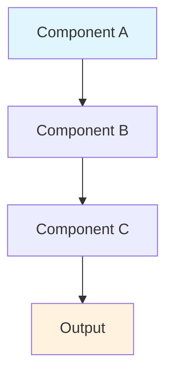

# 📚 Prisma Course Content Standards & Guidelines

## 🎯 **Purpose**
This document defines the quality standards, structure, and formatting guidelines for all Prisma course content to ensure consistency, educational effectiveness, and professional presentation.

---

## 📋 **Content Quality Standards**

### **1. Educational Rigor**
- ✅ **Accuracy**: All technical information must be current and correct
- ✅ **Clarity**: Complex concepts explained in simple, understandable language
- ✅ **Completeness**: Each topic covers all essential aspects
- ✅ **Progression**: Logical flow from basic to advanced concepts
- ✅ **Practical Relevance**: Real-world applications and use cases

### **2. Learning Effectiveness**
- ✅ **Multiple Learning Styles**: Visual, auditory, kinesthetic, reading/writing
- ✅ **Active Learning**: Hands-on exercises and interactive elements
- ✅ **Knowledge Validation**: Regular assessments and self-checks
- ✅ **Retention Support**: Analogies, mnemonics, and visual aids
- ✅ **Application Focus**: Theory backed by practical implementation

### **3. Professional Presentation**
- ✅ **Consistent Formatting**: Standardized markdown structure
- ✅ **Clear Navigation**: Easy movement between sections
- ✅ **Visual Appeal**: Proper use of emojis, formatting, and whitespace
- ✅ **Accessibility**: Content readable across all devices and platforms
- ✅ **Version Control**: Track changes and maintain update history

---

## 🗺️ **Module Development Approach**

### **Systematic Module Creation Strategy**

Each of the 16 modules will be developed following this consistent approach to ensure quality and coherence across the entire course:

#### **Phase 1: Module Planning & Structure**
1. **📁 Create Module Folder**: `XX-module-name/` (e.g., `01-foundations/`)
2. **📄 Module Overview**: Create main module README with:
   - Module introduction and objectives
   - Section breakdown and learning path
   - Prerequisites and estimated duration
   - Assessment criteria and projects

#### **Phase 2: Section Development**
3. **🗂️ Create Section Subfolders**: `X.Y-section-name/` (e.g., `1.1-what-is-prisma/`)
4. **📝 Section Planning**: For each section:
   - Identify 3-5 key learning objectives
   - Plan lesson breakdown (X.Y.1, X.Y.2, etc.)
   - Design progression from basic to advanced
   - Plan practical exercises and examples

#### **Phase 3: Lesson Creation**
5. **📖 Individual Lessons**: Create `X.Y.Z-lesson-name.md` files:
   - Follow standard lesson template
   - Include analogies for complex concepts
   - Add ASCII diagrams and visual aids
   - Provide before/after code examples
   - Include knowledge check quizzes

#### **Phase 4: Enhancement & Integration**
6. **🎯 Add Interactive Elements**:
   - Practical exercises with solutions
   - Real-world project components
   - Cross-references to other modules
   - External resource links

7. **🔗 Navigation & Linking**:
   - Ensure proper lesson sequencing
   - Add breadcrumb navigation
   - Link to related concepts
   - Update module table of contents

#### **Phase 5: Quality Assurance**
8. **✅ Content Review**:
   - Technical accuracy verification
   - Grammar and formatting check
   - Learning objective alignment
   - Flow and pacing validation

#### **Module Development Order**
We'll develop modules in this sequence for maximum learning effectiveness:

1. **01-foundations** ← *Currently developing*
2. **02-getting-started** 
3. **03-schema-design**
4. **04-client-operations**
5. **05-relations**
6. **06-advanced-querying**
7. **07-migrations**
8. **08-performance**
9. **09-testing**
10. **10-deployment**
11. **11-monitoring**
12. **12-integrations**
13. **13-advanced-patterns**
14. **14-security**
15. **15-troubleshooting**
16. **16-legacy-systems-migration**

#### **Quality Checkpoints**
- ✅ After each lesson: Technical review and format validation
- ✅ After each section: Learning flow and objective alignment
- ✅ After each module: Integration testing and cross-references
- ✅ Course-wide: Consistency, progression, and completeness review

---

## 🏗️ **Standard File Structure**

### **Every Content File Must Include:**

```markdown
# [Number]. [Title] ([Subtitle if needed])

## 📋 Section Overview
- **Duration**: X minutes/hours
- **Prerequisites**: [List required knowledge]
- **Learning Objectives**: 
  - Objective 1
  - Objective 2
  - Objective 3
- **Difficulty Level**: Beginner/Intermediate/Advanced

---

## 🎯 What You'll Learn
[Clear, specific learning outcomes with checkboxes]

---

## 📖 Content Sections
[Main educational content with proper numbering]

---

## 🧠 Knowledge Check
[Quiz questions, exercises, or validation activities]

---

## 💡 Key Takeaways
[Summary of most important points]

---

## 🔗 Navigation
**Previous**: [Link to previous content]
**Next**: [Link to next content]
**Module Home**: [Link to module overview]
```

---

## 🔢 **Numbering System**

### **Course Modules (2-digit)**
```
01-foundations
02-getting-started
03-prisma-schema
...
16-legacy-systems-migration
```

### **Lessons within Modules (2-digit)**
```
01-what-is-prisma.md
02-database-fundamentals.md
03-orm-concepts.md
04-development-environment.md
```

### **Sub-sections within Lessons (3-level)**
```
1.1 Introduction to Prisma ORM
1.2 Core Benefits and Features
  1.2.1 Type Safety
  1.2.2 Developer Experience
  1.2.3 Performance Optimization
```

### **Supplementary Content**
```
Appendices: A01, A02, A03, A04...
Resources: R01, R02, R03, R04...
Assessments: S01, S02, S03, S04...
```

---

## 📝 **Content Elements Standards**

### **1. Theory Sections**
```markdown
## 📚 [Topic Name]

### What is [Concept]?
[Clear definition and explanation]

### Why is this Important?
[Relevance and practical significance]

### How Does it Work?
[Technical details and mechanisms]

### When to Use?
[Practical applications and use cases]
```

### **2. Analogies & Explanations**
```markdown
## 🎭 Understanding [Concept]: The [Analogy] Analogy

### Real-World Comparison
[Familiar scenario that mirrors the technical concept]

### Technical Parallel
[How the analogy maps to the actual technology]

### Key Similarities
- Point 1: [Analogy element] → [Technical element]
- Point 2: [Analogy element] → [Technical element]
- Point 3: [Analogy element] → [Technical element]

### Where the Analogy Breaks Down
[Acknowledge limitations to prevent misconceptions]
```

### **3. Visual Diagrams**
```markdown
## 📊 [Diagram Title]



### Diagram Explanation
[Detailed explanation of each component and relationship]
```

### **4. ASCII Diagrams (When Mermaid isn't suitable)**
```markdown
## 🔧 System Architecture

```
┌─────────────┐    ┌─────────────┐    ┌─────────────┐
│ Application │ ───▶ Prisma Client │ ───▶ Database   │
│             │    │             │    │             │
└─────────────┘    └─────────────┘    └─────────────┘
        │                   │                   │
        ▼                   ▼                   ▼
   TypeScript           Generated Code      PostgreSQL
```

[Detailed explanation of the flow and components]
```

### **5. Code Examples**
```markdown
## 💻 Implementation Example

### Basic Usage
```typescript
// Clear, commented example
const user = await prisma.user.create({
  data: {
    email: 'user@example.com',
    name: 'John Doe'
  }
})
```

### Advanced Pattern
```typescript
// More complex example with explanation
const result = await prisma.user.findMany({
  where: {
    posts: {
      some: {
        published: true
      }
    }
  },
  include: {
    posts: true
  }
})
```

### Explanation
[Step-by-step breakdown of what the code does]
```

### **6. Knowledge Validation**
```markdown
## 🧩 Knowledge Check

### Quick Quiz
1. **What is the primary purpose of [concept]?**
   - [ ] A) Option A
   - [x] B) Option B (correct)
   - [ ] C) Option C
   - [ ] D) Option D

   **Explanation**: [Why B is correct and others are wrong]

### Practical Exercise
**Objective**: [Clear goal]

**Instructions**:
1. Step 1
2. Step 2
3. Step 3

**Expected Outcome**: [What should happen]

**Validation**: [How to verify success]

### Self-Assessment
- **Understanding Level (1-5)**: ___
- **Confidence Level (1-5)**: ___
- **Need More Practice?**: Yes / No
- **Questions for Review**: _______________
```

---

## 🎨 **Formatting Standards**

### **Markdown Formatting**
```markdown
# H1 - Module/Main Title
## H2 - Major Section
### H3 - Subsection
#### H4 - Sub-subsection (rarely used)

**Bold** for emphasis
*Italic* for technical terms
`code` for inline code
```code block``` for multi-line code

> Blockquotes for important notes or tips

- Bullet points for lists
1. Numbered lists for sequences

[Link text](url) for references
 for images
```

### **Emoji Usage Guidelines**
```markdown
📚 Theory/Learning content
💻 Code examples
🎯 Objectives/Goals
✅ Completed items/Correct answers
❌ Incorrect answers/Common mistakes
🔧 Tools/Setup
📊 Diagrams/Charts
🧠 Thinking/Mental models
💡 Tips/Insights
🚀 Getting started/Next steps
⚠️ Warnings/Important notes
🎭 Analogies/Metaphors
🧩 Exercises/Puzzles
📝 Assessments/Quizzes
🔗 Navigation/Links
```

### **Navigation Standards**
```markdown
---

## 🔗 Navigation

**📍 Current Location**: Module X → Lesson Y → Section Z

**⬅️ Previous**: [Previous Topic](../previous-file.md)
**➡️ Next**: [Next Topic](../next-file.md)

**🏠 Module Home**: [Module X Overview](./README.md)
**📚 Course Home**: [Main Course](../../README.md)

**🗺️ Quick Links**:
- [Exercises](./exercises/)
- [Code Examples](./code-examples/)
- [Additional Resources](./references/)
```

---

## 🎓 **Assessment Standards**

### **Quiz Question Types**

#### **1. Multiple Choice**
```markdown
**Question**: What is the correct syntax for...?
- [ ] A) Option A
- [ ] B) Option B  
- [x] C) Option C (correct)
- [ ] D) Option D

**Explanation**: [Detailed explanation of why C is correct]
**Common Mistake**: [Why students might choose wrong answers]
```

#### **2. True/False**
```markdown
**Statement**: Prisma can only work with PostgreSQL databases.
- [ ] True
- [x] False

**Explanation**: Prisma supports multiple databases including PostgreSQL, MySQL, SQLite, SQL Server, and MongoDB.
```

#### **3. Fill in the Blank**
```markdown
**Complete the code**:
```typescript
const user = await prisma.user.______({
  where: { id: 1 }
})
```

**Answer**: `findUnique`
**Alternative Answers**: `findFirst` (partial credit)
```

#### **4. Code Analysis**
```markdown
**Analyze this code and identify the issue**:
```typescript
const users = await prisma.user.find({
  where: { email: 'test@example.com' }
})
```

**Issue**: Should be `findMany` instead of `find`
**Corrected Code**: [Provide correct version]
```

#### **5. Scenario-Based**
```markdown
**Scenario**: You need to find all users who have published at least one blog post.

**Your Solution**:
```typescript
// Write your Prisma query here
```

**Sample Answer**: [Provide example solution]
**Discussion**: [Explain different approaches]
```

---

## 🔍 **Quality Assurance Checklist**

### **Before Publishing Any Content**

#### **Content Quality**
- [ ] All technical information is accurate and current
- [ ] Complex concepts are explained with analogies
- [ ] Visual diagrams support understanding
- [ ] Code examples are tested and working
- [ ] Learning objectives are clearly stated and met

#### **Structure & Formatting**
- [ ] Follows standard file structure template
- [ ] Proper heading hierarchy (H1 → H2 → H3)
- [ ] Consistent emoji usage throughout
- [ ] Navigation links are correct and working
- [ ] Numbering follows established system

#### **Educational Effectiveness**
- [ ] Multiple learning styles are addressed
- [ ] Knowledge checks are appropriate and challenging
- [ ] Self-assessment opportunities provided
- [ ] Prerequisites are clearly stated
- [ ] Difficulty progression is logical

#### **Technical Standards**
- [ ] All code examples use proper syntax highlighting
- [ ] Mermaid diagrams render correctly
- [ ] Links are functional and up-to-date
- [ ] File naming follows convention
- [ ] Markdown validates without errors

---

## 🔄 **Content Update Process**

### **Version Control**
1. **Track Changes**: Document all modifications with clear commit messages
2. **Version Numbers**: Use semantic versioning for major updates
3. **Change Log**: Maintain update history in each module
4. **Review Process**: Technical and educational review before publishing

### **Maintenance Schedule**
- **Monthly**: Review for broken links and outdated information
- **Quarterly**: Update code examples for latest Prisma versions
- **Bi-annually**: Comprehensive content review and enhancement
- **As Needed**: Immediate updates for critical corrections

---

## 🎯 **Success Metrics**

### **Content Effectiveness Indicators**
- **Completion Rate**: Percentage of students finishing each module
- **Assessment Scores**: Average quiz and exercise performance
- **Time Spent**: Actual vs. estimated completion times
- **Student Feedback**: Ratings and comments on clarity and usefulness
- **Knowledge Retention**: Follow-up assessments after time delay

### **Quality Benchmarks**
- **Technical Accuracy**: 100% correctness requirement
- **Link Validity**: 100% working links requirement
- **Code Functionality**: 100% tested and working examples
- **Educational Flow**: Logical progression validation
- **Accessibility**: Cross-platform compatibility verification

---

## 💼 **Best Practices Summary**

### **Do's**
✅ Start with clear learning objectives  
✅ Use analogies to explain complex concepts  
✅ Include visual diagrams for better understanding  
✅ Provide hands-on exercises immediately after theory  
✅ Test all code examples before publishing  
✅ Use consistent formatting and structure  
✅ Include multiple assessment types  
✅ Provide clear navigation paths  

### **Don'ts**
❌ Assume prior knowledge without stating prerequisites  
❌ Use jargon without explanation  
❌ Create content without visual aids  
❌ Skip knowledge validation activities  
❌ Use untested or outdated code examples  
❌ Ignore consistent formatting standards  
❌ Forget navigation links  
❌ Overlook accessibility considerations  

---

## 📞 **Support & Questions**

For questions about content standards or implementation:
- **Technical Issues**: Review code examples and test thoroughly
- **Educational Design**: Ensure multiple learning styles are addressed
- **Formatting Questions**: Refer to the formatting standards section
- **Quality Concerns**: Use the QA checklist before publishing

---

**📅 Last Updated**: August 3, 2025  
**🔄 Version**: 1.0  
**👤 Maintained By**: Prisma Course Development Team  

---

*This document serves as the foundation for creating world-class educational content. Adherence to these standards ensures consistency, quality, and educational effectiveness across all course materials.*
